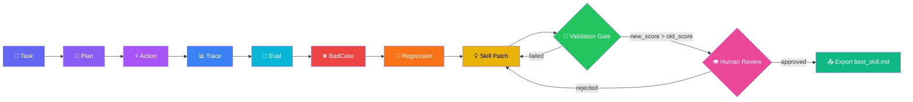
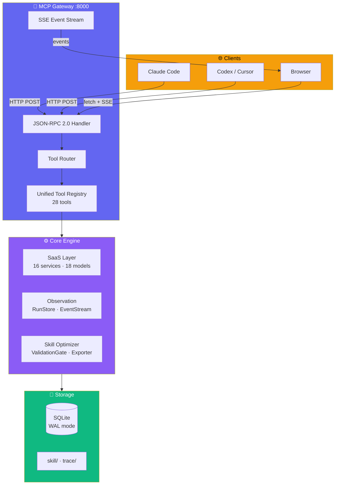

<p align="center">
  
  
  
  
  
  
  
  
</p>

<h1 align="center">☁️ StableAgent Cloud</h1>

<p align="center">
  <strong>AgentOps + SkillOps SaaS</strong><br>
  <sub>让每一个 AI Agent 越用越好 · 不再降智 · 省 Token · 可审计</sub>
</p>

---

## 🎯 What is StableAgent Cloud?

StableAgent Cloud is a **production-grade SaaS platform** that solves the most underrated problem in AI agent development: **agents degrade over time**. They forget. They drift. They hallucinate. And nobody can tell if they're getting better or worse.

We don't just trace your agents — we build a **self-improving closed loop**:



> **Three moats**: Validation Gate quantifies improvement · Human Review prevents unsafe rollouts · Audit Trail is immutable.

---

## 📊 Proven Results (5-round self-iteration)

<table>
<tr>
  <th>Round</th>
  <th>Quality Score</th>
  <th>Hallucination Rate</th>
  <th>Token Usage</th>
  <th>Learning Triggered</th>
</tr>
<tr align="center">
  <td>R1</td>
  <td>0.55</td>
  <td>35%</td>
  <td>4,200</td>
  <td>—</td>
</tr>
<tr align="center">
  <td>R2</td>
  <td>0.60</td>
  <td>30%</td>
  <td>3,900</td>
  <td>✅</td>
</tr>
<tr align="center">
  <td>R3</td>
  <td>0.75</td>
  <td>18%</td>
  <td>3,000</td>
  <td>✅ (compressed)</td>
</tr>
<tr align="center">
  <td>R4</td>
  <td>0.82</td>
  <td>12%</td>
  <td>2,600</td>
  <td>✅</td>
</tr>
<tr align="center" style="background:rgba(99,102,241,0.1);font-weight:700;">
  <td>R5</td>
  <td><strong>0.85</strong></td>
  <td><strong>10%</strong></td>
  <td><strong>2,310</strong></td>
  <td>✅</td>
</tr>
</table>

> 📈 **5 rounds**: Score +54% · Hallucination -71% · Token -45% → **The agent literally gets better with every run.**

---

## 🚀 Quick Start

```bash
# 1. Clone & install
git clone https://github.com/liuanye9-lab/OS-Agent.git
cd OS-Agent
pip install -r requirements.txt

# 2. Start
uvicorn web.server:app --host 0.0.0.0 --port 8000

# 3. Open
open http://localhost:8000          # Dashboard
open http://localhost:8000/login     # Login / Register
open http://localhost:8000/docs      # Swagger API Docs
```

```bash
# Or with Docker
docker-compose up -d
```

---

## 🖥️ Full SaaS Platform (12 pages)

<table>
<tr>
  <th>Page</th>
  <th>URL</th>
  <th>Purpose</th>
</tr>
<tr>
  <td>🔐 <strong>Login / Register</strong></td>
  <td><code>/login</code></td>
  <td>JWT-based authentication with dual-tab UI</td>
</tr>
<tr>
  <td>📊 <strong>Dashboard</strong></td>
  <td><code>/</code></td>
  <td>Real-time agent monitoring with glassmorphism UI</td>
</tr>
<tr>
  <td>🔌 <strong>Connect</strong></td>
  <td><code>/connect</code></td>
  <td>One-click MCP setup for Claude Code / Codex / Cursor</td>
</tr>
<tr>
  <td>📈 <strong>Usage</strong></td>
  <td><code>/dashboard/usage</code></td>
  <td>Chart.js dashboard with token trends + quota bars</td>
</tr>
<tr>
  <td>🔑 <strong>API Keys</strong></td>
  <td><code>/dashboard/apikeys</code></td>
  <td>Create / revoke / list API keys with one-time display</td>
</tr>
<tr>
  <td>💳 <strong>Billing</strong></td>
  <td><code>/dashboard/billing</code></td>
  <td>4-tier plan comparison (Free / Pro / Team / Enterprise)</td>
</tr>
<tr>
  <td>👥 <strong>Team</strong></td>
  <td><code>/dashboard/team</code></td>
  <td>Member invite + 5-level role management</td>
</tr>
<tr>
  <td>🧠 <strong>Skills</strong></td>
  <td><code>/dashboard/skills</code></td>
  <td>Skill library browser + patch status tracker</td>
</tr>
<tr>
  <td>✅ <strong>Review</strong></td>
  <td><code>/dashboard/review</code></td>
  <td>Human review queue with approve / reject</td>
</tr>
<tr>
  <td>📖 <strong>API Docs</strong></td>
  <td><code>/docs</code></td>
  <td>Interactive Swagger UI for all 44 endpoints</td>
</tr>
<tr>
  <td>📘 <strong>ReDoc</strong></td>
  <td><code>/redoc</code></td>
  <td>Alternative API documentation</td>
</tr>
<tr>
  <td>🚫 <strong>404</strong></td>
  <td><code>/*</code></td>
  <td>Custom glassmorphism error page</td>
</tr>
</table>

---

## 🔌 MCP Integration (28 tools)

Connect any MCP-compatible client in 3 steps:

```json
{
  "mcpServers": {
    "stableagent": {
      "url": "http://localhost:8000/mcp",
      "transport": "http"
    }
  }
}
```

### Tool Catalog

| Domain | Tools |
|--------|-------|
| `stableagent.task.*` | `process`, `os_agent` — end-to-end execution |
| `stableagent.context.*` | `build`, `estimate_budget` — context packaging |
| `stableagent.memory.*` | `retrieve`, `write_candidate` — memory ops |
| `stableagent.eval.*` | `evaluate`, `run` — evaluation & scoring |
| `stableagent.skillopt.*` | `status`, `get_current_skill`, `run_epoch`, `export_best` |
| `stableagent.skill.*` | `patch_propose`, `validate`, `review`, `export_best` |
| `stableagent.workspace.*` | `create` — SaaS workspace management |
| `stableagent.project.*` | `create`, `list` — project lifecycle |
| `stableagent.run.*` | `get` — run status & trace |
| `stableagent.regression.*` | `create` — BadCase → regression case |
| `stableagent.usage.*` | `get` — token & cost tracking |
| `stableagent.apikey.*` | `create`, `revoke` — API key lifecycle |

> All tools auto-inject `workspace_id` / `project_id` via context resolution. Local mode falls back gracefully.

---

## 🏗️ Architecture



---

## 🔐 SaaS Capabilities

<table>
<tr>
  <th width="180">Capability</th>
  <th>Implementation</th>
</tr>
<tr>
  <td>🔐 <strong>Auth</strong></td>
  <td>JWT (HMAC-SHA256, 24h TTL) · Register · Login · Token verify</td>
</tr>
<tr>
  <td>👥 <strong>Multi-tenancy</strong></td>
  <td>Workspace → Project → Run three-level scoping</td>
</tr>
<tr>
  <td>🗂️ <strong>RBAC</strong></td>
  <td>5 roles: Owner · Admin · Developer · Reviewer · Viewer</td>
</tr>
<tr>
  <td>🔑 <strong>API Keys</strong></td>
  <td>SHA256 hashed · prefix `sk_` · one-time display · revocable</td>
</tr>
<tr>
  <td>📈 <strong>Usage Metering</strong></td>
  <td>Per-project events / tokens / cost tracking</td>
</tr>
<tr>
  <td>💳 <strong>Billing</strong></td>
  <td>4 tiers: Free · Pro ($29/mo) · Team ($99/mo) · Enterprise</td>
</tr>
<tr>
  <td>📋 <strong>Audit Log</strong></td>
  <td>13 event types · immutable · per-workspace query</td>
</tr>
<tr>
  <td>🚦 <strong>Rate Limiting</strong></td>
  <td>Sliding window: Free 10/min · Pro 60/min · Team 300/min</td>
</tr>
<tr>
  <td>🌐 <strong>CORS</strong></td>
  <td>Full cross-origin support for external API access</td>
</tr>
</table>

---

## 📦 Tech Stack

| Layer | Technology | Why |
|-------|-----------|-----|
| **Runtime** | Python 3.13 | Modern async support |
| **Web Framework** | FastAPI | Auto OpenAPI docs, async-native |
| **Database** | SQLite (WAL mode) | Zero-config, single-file, 923-test proven |
| **Frontend** | Vanilla JS + Chart.js | Zero framework overhead, 12 pages |
| **CSS** | Glassmorphism + MD3 tokens | iOS-inspired blur + rounded corners |
| **MCP** | JSON-RPC 2.0 + SSE | Standard protocol, 28 namespaced tools |
| **Auth** | HMAC-SHA256 JWT | No external dependency, self-contained |
| **Deploy** | Docker · docker-compose | Single-command launch |
| **Test** | pytest (923 tests) | Full coverage: unit + integration + E2E |

---

## 📁 Project Structure

```
StableAgent Cloud/
├── stable_agent/
│   ├── saas/                    ← SaaS business layer
│   │   ├── models.py            │  18 dataclass models
│   │   ├── repository.py        │  SQLite CRUD for all tables
│   │   ├── permissions.py       │  5-level role matrix
│   │   ├── auth.py              │  JWT auth manager
│   │   ├── api_keys.py          │  API key lifecycle
│   │   ├── billing.py           │  4-tier plan + quota checks
│   │   ├── audit_log.py         │  13 event types
│   │   ├── rate_limiter.py      │  Sliding window limiter
│   │   ├── usage.py             │  Token/cost counter
│   │   ├── workspace_service.py │  Workspace CRUD
│   │   ├── project_service.py   │  Project CRUD
│   │   ├── run_service.py       │  Agent run lifecycle
│   │   ├── regression_service.py│  BadCase → regression
│   │   └── skill_review_service.py│ Validation + Human Review
│   ├── gateway/                 ← MCP Gateway (V5)
│   │   ├── mcp_gateway.py       │  Unified entry point
│   │   ├── tool_schemas.py      │  28 tool JSON schemas
│   │   ├── unified_tool_registry.py│ Handler registry
│   │   ├── tool_router.py       │  Context injection + routing
│   │   ├── run_context.py       │  Per-call context
│   │   └── jsonrpc_handler.py   │  JSON-RPC 2.0 processor
│   ├── observation/             ← Trace & Event system
│   │   ├── run_store.py         │  In-memory run state
│   │   ├── event_stream.py      │  Pub/sub event bus
│   │   ├── dashboard_sync.py    │  WebSocket bridge
│   │   └── decision_narrator.py │  DecisionTrace explainer
│   └── skill_optimizer/         ← Self-improvement engine
│       ├── models.py            │  SkillDocument · ValidationResult
│       ├── validation_gate.py   │  new_score > old_score gate
│       ├── skill_exporter.py    │  best_skill.md exporter
│       └── optimization_engine.py│  Patch merge engine
├── web/
│   ├── server.py                ← FastAPI 44-endpoint entry
│   ├── templates/               ← 12 HTML pages
│   └── static/                   ← CSS / JS / Chart.js
├── tests/                        ← 923 tests (61 test files)
├── Dockerfile                    ← Production image
├── docker-compose.yml            ← One-command deploy
├── .env.example                  ← Configuration template
└── requirements.txt              ← Python dependencies
```

---

## ✅ Verification

```bash
# Run all tests
pytest tests/ -q --ignore=tests/test_mcp_gateway.py

# Result
923 passed, 0 failed, 33 warnings

# Verify all pages return 200
for p in / /login /connect /dashboard/v3 /dashboard/usage \
  /dashboard/apikeys /dashboard/billing /dashboard/team \
  /dashboard/skills /dashboard/review /docs /redoc; do
  curl -s -o /dev/null -w "%{http_code}" http://localhost:8000$p
done
# Output: 200 200 200 200 200 200 200 200 200 200 200 200
```

---

## 🤝 Contributing

```bash
git clone https://github.com/liuanye9-lab/OS-Agent.git
cd OS-Agent
pip install -r requirements.txt
pytest tests/ -q
# 923 passed → you're ready to contribute!
```

---

## 📄 License

MIT © 2026 [liuanye9-lab](https://github.com/liuanye9-lab)

---

<p align="center">
  <sub>Built with ❤️ · 170 Python files · 27 git commits · 10 iterations · 1 day</sub>
</p>
