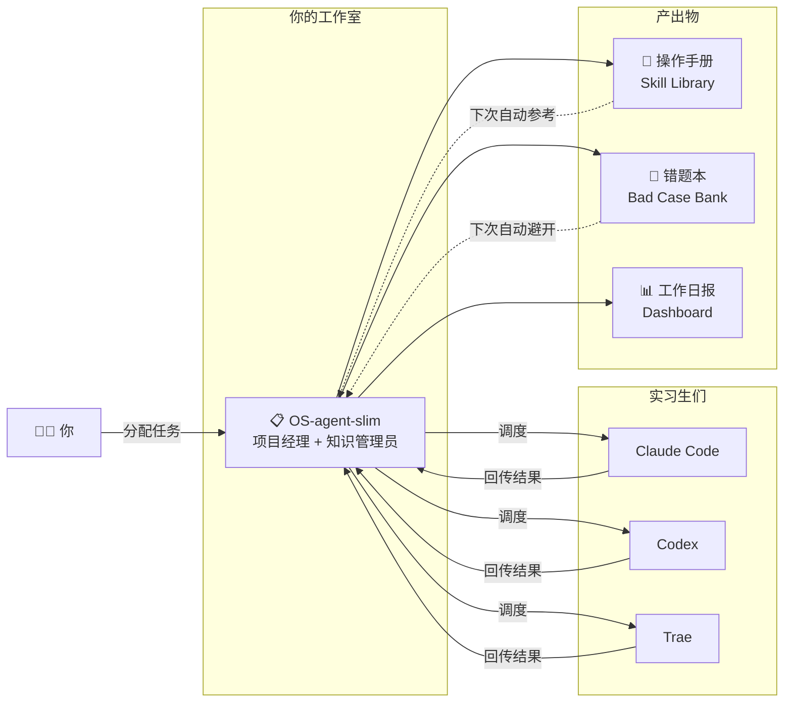
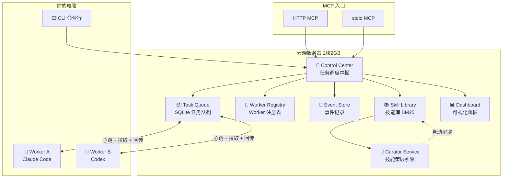
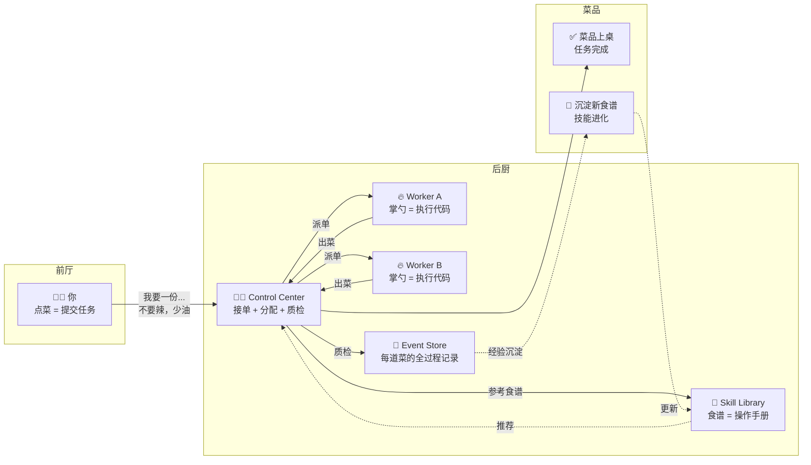
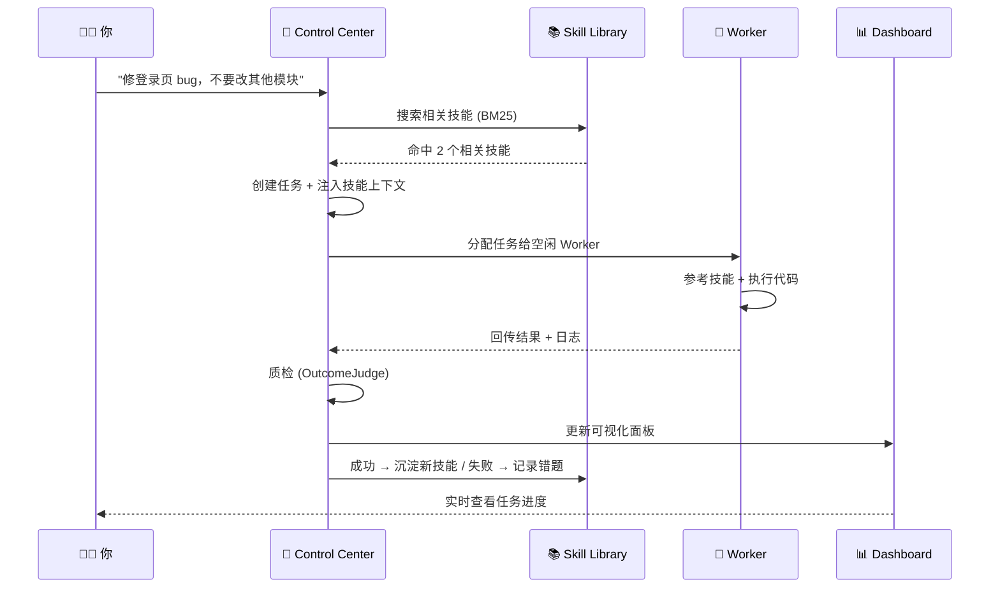
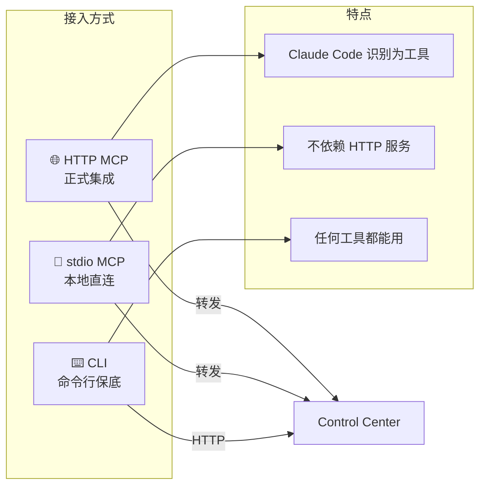
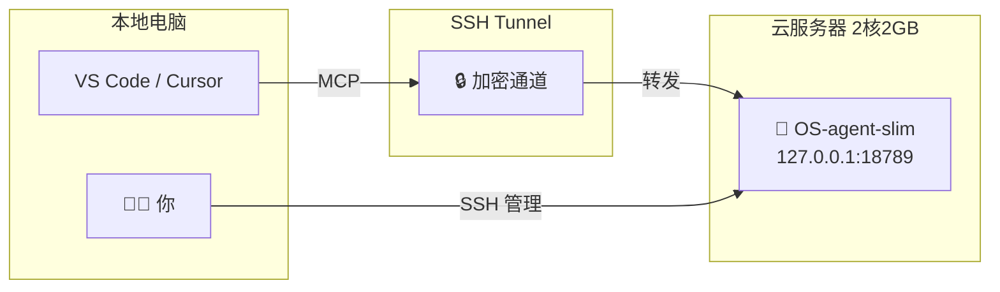
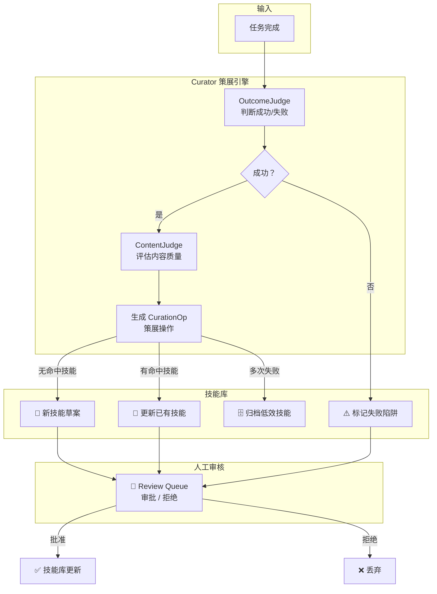

<p align="center">
  
  
  
  
</p>

<h1 align="center">StableAgent OS — Slim Cloud Edition</h1>

<p align="center">
  <strong>给 AI Coding Agent 配一个云端"调度塔"</strong><br />
  <sub>2 核 2GB 云服务器可跑 · SQLite 单文件 · 无重型依赖 · 技能库自进化</sub>
</p>

---

## 一句话：这是什么？

**OS-agent-slim 是一套跑在云服务器上的"AI 任务调度塔"。**

它不训练模型，不做聊天壳。它做的事情用一个比喻就能说清——

> 想象你开了一家小型工作室。你雇了几个实习生（Claude Code、Codex、Trae），他们很聪明，但总会犯同样的错、忘记你的习惯、把简单任务搞复杂。
>
> **OS-agent-slim 就是这家工作室的"项目经理 + 知识管理员"**：它帮你把任务分发给合适的实习生，记住每个任务的全过程，把好的经验沉淀成操作手册，把踩过的坑变成预警规则。



---

## 为什么需要一个"调度塔"？

直接用 AI Coding 工具干活，常见问题：

```
你：修这个 bug，别改其他文件。

实习生 A：改了 15 个文件，引入 2 个新 bug。
实习生 B：修好了，但用了一种你讨厌的写法。
实习生 C：花了 30 分钟在错误方向上，最后问你要不要换思路。
下个月遇到类似 bug：三个实习生全部重蹈覆辙。
```

**根本原因**：每个实习生都是"短期记忆"，没有项目级的长期知识沉淀。

**OS-agent-slim 的解法**：

| 问题 | 传统方式 | OS-agent-slim |
|------|---------|---------------|
| 忘记你的习惯 | 每次重新交代 | 表达习惯自动记忆 |
| 重复犯同样的错 | 人工提醒 | 错题本自动预警 |
| 不知道 AI 干了啥 | 黑箱 | Dashboard 全程可视化 |
| 好经验没沉淀 | 随风飘散 | 技能库自动进化 |
| 多个 AI 工具不互通 | 各自为战 | 统一调度 + 统一记忆 |

---

## 系统全貌



---

## 核心类比：把 AI 任务管理想成"餐厅后厨"



**每个角色的职责**：

- **🧑‍💻 你（食客）**：告诉系统要做什么，有什么偏好和约束
- **👨‍🍳 Control Center（主厨）**：接单、分配给合适的 Worker、质检、记录全过程
- **🔥 Worker（灶台）**：真正执行代码的 AI 工具（Claude Code / Codex / Trae）
- **📖 Skill Library（食谱架）**：经过验证的操作手册，新任务来了先查
- **📕 Event Store（错题本）**：每道菜的完整过程记录，出了问题能回溯
- **🔬 Curator（菜品研发）**：从成功经验中提炼新食谱，从失败中总结教训

---

## 一次任务的完整旅程



---

## 三种接入方式

就像餐厅可以堂食、外卖、电话订餐一样，OS-agent-slim 提供三种接入方式：



| 方式 | 是否需要 server | AI 工具识别为工具 | 适合场景 |
|------|:-:|:-:|------|
| HTTP MCP | ✅ 需要 | ✅ 是 | 正式集成、远程服务器 |
| stdio MCP | ❌ 不需要 | ✅ 是 | 本地开发、稳定集成 |
| CLI | ❌ 不需要 | ❌ 通过 Bash | fallback、自动化脚本 |

---

## 快速开始

### 1. 克隆

```bash
git clone https://github.com/liuanye9-lab/OS-agent-slim.git
cd OS-agent-slim
```

### 2. 安装依赖

```bash
python3.11 -m venv .venv
source .venv/bin/activate
pip install -r requirements-slim.txt
```

### 3. 启动服务

```bash
PYTHONPATH=. .venv/bin/python -m stable_agent.cli serve --profile slim
```

### 4. 验证

```bash
# 健康检查
curl http://127.0.0.1:18789/api/cloud/health

# Dashboard
open http://127.0.0.1:18789/slim
```

### 5. 通过 MCP 接入 Claude Code

在 `.mcp.json` 中添加：

```json
{
  "mcpServers": {
    "stableagent": {
      "type": "http",
      "url": "http://127.0.0.1:18789/mcp/",
      "timeout": 60000
    }
  }
}
```

---

## 部署到云服务器

OS-agent-slim 专为 2 核 2GB 云服务器设计（如阿里云 ECS）。



```bash
# 一键部署到服务器
bash scripts/deploy_openclaw_slim.sh

# SSH Tunnel（本地访问）
ssh -fN -i "your-key.pem" \
  -o IdentitiesOnly=yes \
  -o ExitOnForwardFailure=yes \
  -L 18789:127.0.0.1:18789 \
  root@YOUR_SERVER_IP

# 然后本地访问 http://127.0.0.1:18789/slim
```

---

## SkillOS：技能自进化系统

这是 OS-agent-slim 最核心的差异化能力。用"错题本 → 操作手册"的类比来理解：



**关键原则**：失败经验不能直接污染技能库，必须经过验证和人工审核。

---

## 项目结构

```text
OS-agent-slim/
├── stable_agent/           # 核心代码
│   ├── cloud/              # 🏢 Control Center（调度中枢）
│   │   ├── control_center.py   # 核心调度
│   │   ├── task_queue.py       # SQLite 任务队列
│   │   ├── worker_registry.py  # Worker 注册表
│   │   ├── worker_client.py    # 本地 Worker 客户端
│   │   ├── event_store.py      # 事件记录
│   │   ├── scheduler.py        # 任务调度器
│   │   ├── security.py         # Token 认证
│   │   └── config.py           # 配置管理
│   ├── skills/             # 📚 SkillOS（技能系统）
│   │   ├── repo.py             # 技能库（SQLite）
│   │   ├── retriever.py        # BM25 检索
│   │   ├── curator_service.py  # 策展引擎
│   │   ├── judges.py           # 结果/内容评判
│   │   ├── rollback.py         # 版本回滚
│   │   └── schema.py           # 数据模型
│   ├── gateway/            # 🌐 MCP Gateway
│   │   ├── mcp_gateway.py      # MCP 入口
│   │   ├── tool_schemas.py     # 工具定义
│   │   └── unified_tool_registry.py  # 工具注册
│   ├── cli.py              # ⌨️ CLI 命令行
│   └── mcp_stdio.py        # 📡 stdio MCP
├── web/                    # 🌐 Web 服务
│   ├── app_slim.py             # Slim 应用工厂
│   ├── server_slim.py          # Slim 入口
│   ├── routes/                 # API 路由
│   └── templates/              # Dashboard 模板
├── scripts/                # 🔧 部署脚本
├── tests/                  # 🧪 测试
└── docs/                   # 📖 文档
```

---

## 核心设计原则

| 原则 | 说明 |
|------|------|
| 🪶 轻量优先 | 2 核 2GB 可跑，SQLite 单文件，无 Redis/Postgres/Celery |
| 🔒 安全默认 | 本地 127.0.0.1 绑定，可选 Token 认证，危险命令拦截 |
| 📦 可迁移 | Agent Capsule 可导出/导入，换工具不丢记忆 |
| 👁️ 可观测 | Dashboard 全程可视化，事件时间线可回溯 |
| 🔄 可回滚 | 技能版本化存储，一键回退到任意历史版本 |
| 🧪 可验证 | Effectiveness Dashboard 用 A/B 数据证明有效性 |

---

## 适合谁？

**适合**：
- 高频使用 Claude Code / Codex / Trae / Cursor 的开发者
- 经常遇到 AI 长任务跑偏、重复犯错的人
- 想把项目经验和失败教训沉淀下来的人
- 想做 Agent / MCP / AI Workflow 产品的人

**不适合**：
- 只想一次性问答的人
- 不需要长期项目记忆的人

---

## License

MIT

---

<p align="center">
  <strong>OS-agent-slim — 让 AI Coding 从"一次性对话"变成"长期积累的工作伙伴"。</strong>
</p>
