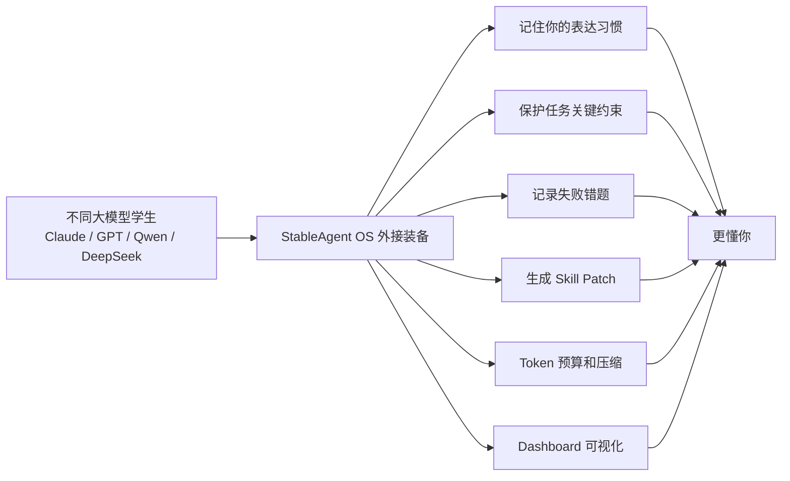
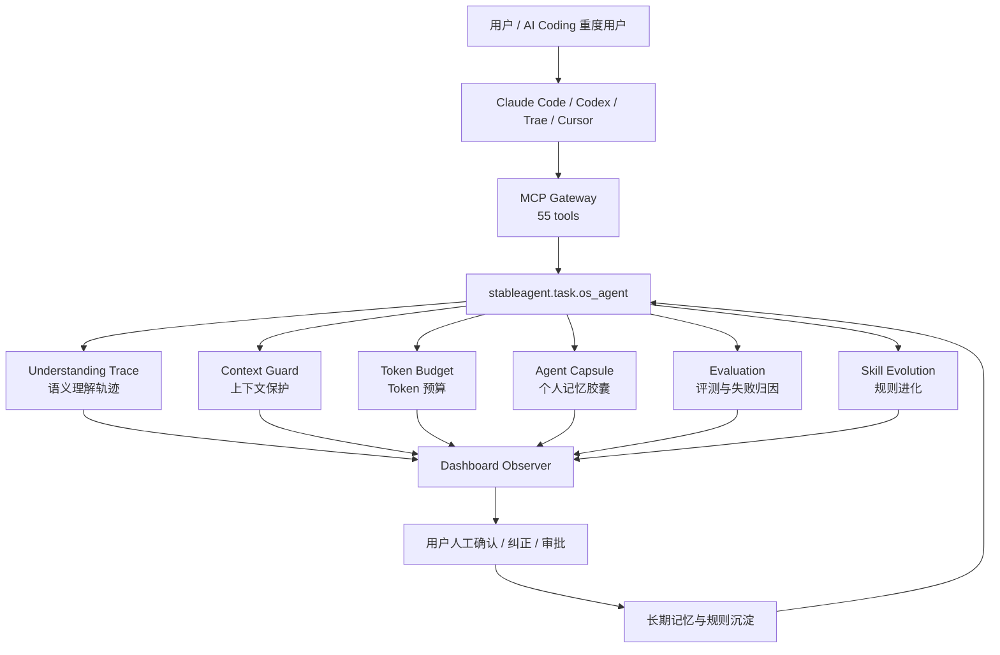
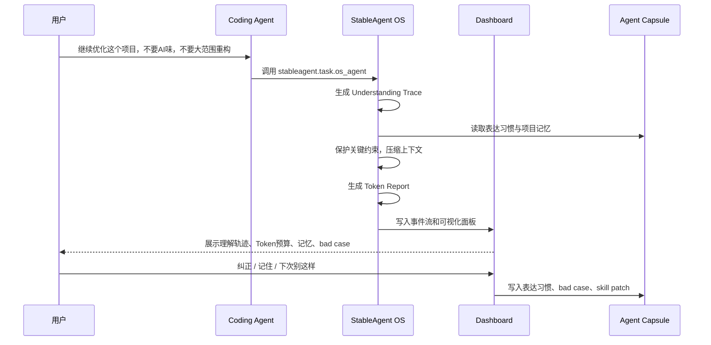
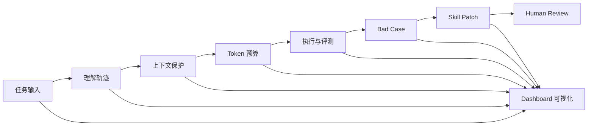
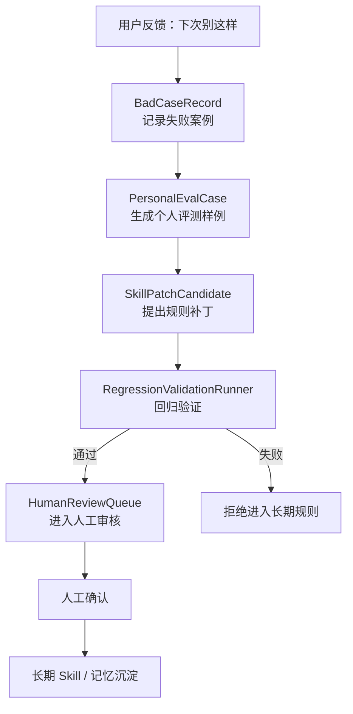
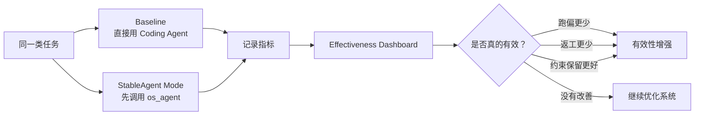
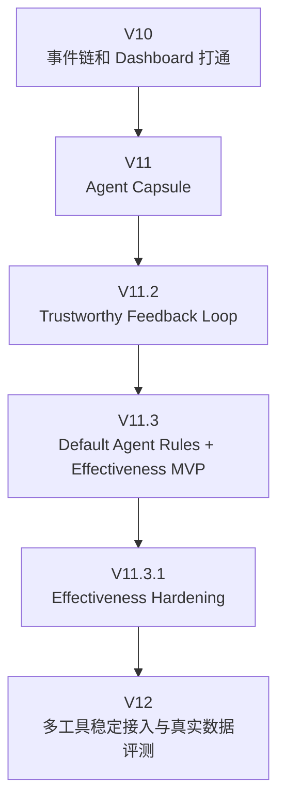

<p align="center">
  
  
  
  
  
</p>

<h1 align="center">StableAgent OS</h1>

<p align="center">
  <strong>给 AI Coding Agent 配一套“外接大脑”</strong><br />
  <sub>记住你的习惯 · 防止任务跑偏 · 记录失败经验 · 可视化每一次 Agent 思考</sub>
</p>

---

## 这个项目一句话是什么？

**StableAgent OS 是一个接在 Claude Code / Codex / Trae / Cursor 这类 AI Coding 工具旁边的“个人 Agent 操作系统”。**

它不训练模型权重，也不是另一个聊天机器人。它做的是：

> 把你的表达习惯、项目上下文、失败经验、评测标准、Token 预算和 Dashboard 轨迹，打包成一套可迁移的 **Agent Capsule**，让不同 AI 工具更稳定地理解你。

可以把它想成：

| 类比 | StableAgent OS 是什么 |
|---|---|
| 学生 | 大模型本身，例如 Claude / GPT / Qwen / DeepSeek |
| 老师 | 你对模型的反馈和纠正 |
| 错题本 | Bad Case Bank，记录模型犯过的错 |
| 学习计划 | Skill Patch，把失败经验变成可复用规则 |
| 书包/U 盘 | Agent Capsule，打包你的记忆、规则、习惯和评测标准 |
| 仪表盘 | Dashboard，把 Agent 每一步理解、压缩、判断、学习过程可视化 |

---

## 为什么需要 StableAgent OS？

AI Coding 工具越来越强，但长任务里经常出现这些问题：

```text
你说：只修这个小 bug，不要大范围重构。

AI 可能会：
1. 改了 12 个无关文件；
2. 忘了你刚刚强调的约束；
3. 生成看似正确但无法运行的代码；
4. 同一个错误下次继续犯；
5. 解释得很自信，但你不知道它到底怎么理解任务；
6. token 越堆越多，最后上下文又乱又贵。
```

StableAgent OS 想解决的是：

> **不是让模型“变聪明”，而是给模型外面装一层能记忆、能复盘、能约束、能可视化的使用层。**

---

## 核心比喻：给每个模型学生配一套“学习装备”

不同大模型就像不同学生：

- 有些写代码强，但容易过度修改；
- 有些推理强，但工具调用慢；
- 有些文案自然，但工程稳定性弱；
- 有些便宜好用，但上下文保护差。

StableAgent OS 不去改学生的大脑，而是给学生配装备：



换句话说：

> 模型能力会不断迭代，但你的个人使用层也应该能成长。StableAgent OS 就是这套可迁移的个人使用层。

---

## 项目目标

StableAgent OS 的目标不是做一个“更大的 Agent”，而是做一个 **AI Coding 用户的个人稳定层**。

它要做到：

1. **不跑偏**：任务开始前先理解你的真实意图；
2. **不失忆**：把长期偏好、项目记忆、表达习惯存在 Agent Capsule 里；
3. **不重复犯错**：把 bad case 转成 regression case 和 skill patch；
4. **不瞎压缩上下文**：Token 预算时保护关键约束；
5. **不黑箱执行**：Dashboard 展示每一步发生了什么；
6. **不只靠感觉证明有用**：Effectiveness Dashboard 用 A/B 数据验证是否真的更稳。

---

## 整体架构



---

## Agent Capsule：像 U 盘一样带走你的 AI 使用习惯

StableAgent OS 的核心不是一次任务，而是长期积累的 **Agent Capsule**。

它可以理解为：

```text
.stableagent-capsule/
├── profile/              # 你的表达习惯，比如“不要AI味”是什么意思
├── memory/               # 长期记忆、项目记忆、偏好记忆
├── skills/               # 经过验证的工作规则
├── bad_cases/            # 模型犯过的错
├── evals/                # 个人评测样例和回归测试
├── token_ledger/         # Token 使用和节省记录
├── model_profiles/       # 不同模型的能力画像
└── effectiveness/        # 项目有效性 A/B 数据
```

它的目标是：

> 不管你今天用 Claude Code，明天用 Codex，后天换 Trae，你的习惯、错题本、评测标准和任务边界都可以继续迁移。

---

## 一次任务在 StableAgent 里如何流动？



---

## V11 Dashboard：让 Agent 的“脑内过程”可视化

Dashboard 不是普通日志页面，它更像是 Agent 的监控仪表盘。

它会展示：

| 面板 | 作用 |
|---|---|
| Run Trace / 事件时间线 | 这次任务从接收到完成经历了哪些步骤 |
| Understanding Panel | 系统如何理解你的原话，有哪些假设和不确定点 |
| Token Budget | 原本要塞多少上下文，实际保留多少，节省多少 |
| Memory Map | 这次任务用了哪些长期记忆和表达习惯 |
| Bad Case Bank | 出现了哪些失败案例，是否生成回归测试 |
| Skill Evolution | 是否生成新的 Skill Patch，是否进入验证/人工审核 |
| Memory Health | 哪些记忆该保留、合并、删除或人工审核 |



---

## 反馈闭环：把“下次别这样”变成可验证规则

传统 AI 工具里，你说一句“下次别这样”，模型可能下一轮就忘了。

StableAgent OS 会把这句话变成结构化闭环：



关键原则：

> 失败经验不能直接污染长期规则，必须经过验证和人工审核。

---

## 表达习惯学习：让模型理解你的“人话”

比如你说：

```text
不要AI味。
```

模型可能不知道你具体指什么。

StableAgent 可以把它记录成：

```json
{
  "phrase": "不要AI味",
  "normalized_meaning": [
    "避免模板化表达",
    "保持克制",
    "减少空泛营销腔"
  ],
  "scope": "global",
  "confidence": 0.7
}
```

之后你再说：

```text
这个 README 不要AI味，写得自然一点。
```

StableAgent 会在 Understanding Trace 里命中这个表达习惯，让 Coding Agent 少猜一步。

---

## Effectiveness Dashboard：不靠感觉，靠数据证明项目有没有用

工程闭环成立，不等于产品有效。

StableAgent OS 新增了 Effectiveness Dashboard，用来做 A/B 对比：



它关注这些指标：

| 指标 | 解释 | 希望变化 |
|---|---|---|
| success_rate | 任务是否完成 | 上升 |
| test_pass_rate | 测试是否通过 | 上升 |
| intent_drift_rate | 是否跑偏 | 下降 |
| over_editing_rate | 是否过度修改 | 下降 |
| constraint_preservation_rate | 是否保留约束 | 上升 |
| bad_case_recurrence_rate | 同类错误是否复发 | 下降 |
| avg_rework_count | 平均返工次数 | 下降 |
| avg_estimated_tokens | Token 消耗 | 下降或不明显上升 |
| avg_user_satisfaction | 用户满意度 | 上升 |

---

## 默认调用规则：AGENTS.md / CLAUDE.md

项目已经加入默认规则文件：

```text
AGENTS.md
CLAUDE.md
```

目标是让 Coding Agent 打开本仓库时默认知道：

> 非平凡编码任务开始前，先调用 `stableagent.task.os_agent`，生成 run_id 和 Dashboard，再继续执行。

典型调用：

```json
{
  "method": "tools/call",
  "params": {
    "name": "stableagent.task.os_agent",
    "arguments": {
      "task_input": "继续优化这个项目，不要AI味，不要大范围重构无关文件",
      "open_dashboard": true
    }
  }
}
```

---

## 快速开始

### 1. 克隆项目

```bash
git clone https://github.com/liuanye9-lab/OS-Agent.git
cd OS-Agent
```

### 2. 使用 Python 3.11+

macOS 示例：

```bash
brew install python@3.11
python3.11 -m venv .venv
source .venv/bin/activate
python -m pip install --upgrade pip
python -m pip install -r requirements.txt
```

### 3. 启动服务

```bash
PYTHONPATH=. uvicorn web.server:app --host 127.0.0.1 --port 8000
```

启动成功后访问：

```text
http://127.0.0.1:8000/api/health
```

预期：

```json
{
  "ok": true,
  "service": "StableAgent OS"
}
```

---

## MCP 接入配置

推荐配置：

```json
{
  "mcpServers": {
    "stableagent": {
      "type": "streamableHttp",
      "url": "http://127.0.0.1:8000/mcp/",
      "timeout": 60000
    }
  }
}
```

调试工具列表：

```bash
curl http://127.0.0.1:8000/mcp/tools
```

调用主工具：

```bash
curl -s -X POST http://127.0.0.1:8000/mcp/ \
  -H "Content-Type: application/json" \
  -d '{
    "jsonrpc": "2.0",
    "method": "tools/call",
    "params": {
      "name": "stableagent.task.os_agent",
      "arguments": {
        "task_input": "继续优化这个项目，不要AI味，不要大范围重构无关文件",
        "open_dashboard": true
      }
    },
    "id": 1
  }'
```

---

## 常用页面

| 页面 | 地址 |
|---|---|
| 健康检查 | `http://127.0.0.1:8000/api/health` |
| MCP 工具列表 | `http://127.0.0.1:8000/mcp/tools` |
| Run Observer | `http://127.0.0.1:8000/observe/{run_id}?check=1` |
| Run Detail | `http://127.0.0.1:8000/runs/{run_id}` |
| Effectiveness Dashboard | `http://127.0.0.1:8000/effectiveness` |
| API Docs | `http://127.0.0.1:8000/docs` |

---

## 当前能力状态

| 能力 | 状态 |
|---|---|
| MCP Gateway | 已支持 JSON-RPC / tools / health / SSE |
| stableagent.task.os_agent | 已接入主流程 |
| Understanding Trace | 已支持 |
| Expression Profile | 已支持 |
| Token Budget Ledger | 已支持 |
| FeedbackLearningService | 已支持 |
| Bad Case → Eval Case → Skill Patch | 已支持 |
| Validation → Human Review | 已支持 |
| Dashboard 六大面板 | 已支持 |
| AGENTS.md / CLAUDE.md | 已支持 |
| Effectiveness Dashboard | MVP 已支持，仍需真实 A/B 数据积累 |

---

## 项目不是在做什么？

StableAgent OS **不是**：

- 不是微调模型；
- 不是训练新的基础大模型；
- 不是另一个聊天壳；
- 不是普通 prompt 模板库；
- 不是只做日志记录。

它真正做的是：

> 把 AI Coding 的使用过程变成一个可记忆、可评测、可纠正、可迁移、可视化的系统。

---

## 适合谁使用？

适合：

- 高频使用 Claude Code / Codex / Trae / Cursor 的开发者；
- 经常遇到 AI 长任务跑偏的人；
- 想把个人提示词、项目习惯、失败经验沉淀下来的人；
- 想验证 AI Coding 是否真的提升效率的人；
- 想做 Agent / MCP / AI Workflow 产品的人。

不适合：

- 只想一次性问答的人；
- 不需要长期项目记忆的人；
- 不关心可视化、评测和复盘的人。

---

## 项目路线图



### 下一步重点

- [ ] 修正 Effectiveness schema，加入 `test_passed / rework_count / user_satisfaction` 等完整指标；
- [ ] 将 Effectiveness 数据默认写入 `.stableagent-capsule/effectiveness/`；
- [ ] 统一 `/api/effectiveness/*` 返回结构；
- [ ] Run Observer 增加“记录到 Effectiveness”；
- [ ] 积累至少 10 个真实 A/B 任务数据；
- [ ] 输出一份真实效果报告。

---

## 最小有效性实验

想证明 StableAgent 是否真的有用，不要靠感觉，跑 10 个任务：

```text
同类任务 A：直接用 Coding Agent 做。
同类任务 B：先调用 StableAgent，再让 Coding Agent 做。
```

记录：

```json
{
  "task_id": "T01",
  "mode": "baseline | stableagent",
  "success": true,
  "test_passed": true,
  "intent_drift": false,
  "over_editing": false,
  "constraint_preserved": true,
  "rework_count": 1,
  "estimated_tokens": 12000,
  "user_satisfaction": 4
}
```

如果 StableAgent 组出现：

```text
跑偏率下降
返工次数下降
约束保留率上升
bad case 复发率下降
测试通过率不下降
```

才说明它真的有效。

---

## 项目背后的核心思想

StableAgent OS 的底层判断是：

> 未来的大模型会越来越强，但每个人真正需要的是“适配自己”的外部使用层。

模型像发动机，StableAgent 像仪表盘、导航、刹车、错题本和驾驶习惯记录器。

发动机升级当然重要，但如果没有稳定的驾驶系统，长任务依然会跑偏。

StableAgent OS 想做的就是这套系统。

---

## License

MIT

---

<p align="center">
  <strong>StableAgent OS — 让 AI Coding 不只是会做，而是可记忆、可复盘、可验证地越用越懂你。</strong>
</p>
