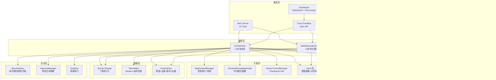

# StableAgent OS

> 一个通过记忆、上下文预算、工作流、评测、Trace 和 Skill 自迭代机制，让 AI Agent 越用越懂用户意图、越用越稳定、越用越省 token 的操作系统。


---

## 一句话定位

**AI 越用越懂用户 ≠ 把所有聊天记录塞进上下文**  
**AI 越用越懂用户 = 从历史任务中提炼出可验证、可复用、可压缩的执行规则**

StableAgent OS 不是微调模型，而是训练一份可部署、可审计、可回滚的 `best_skill.md`——你的 AI 助手的"使用者意图说明书"。

---

## 目录

- [核心能力](#核心能力)
- [架构设计](#架构设计)
- [项目结构](#项目结构)
- [快速开始](#快速开始)
- [四级架构详解](#四级架构详解)
- [MCP 工具参考](#mcp-工具参考)
- [SkillOpt 自迭代优化循环](#skillopt-自迭代优化循环)
- [仪表盘](#仪表盘)
- [技术栈](#技术栈)
- [开发指南](#开发指南)
- [路线图](#路线图)

---

## 核心能力

### 🧠 防止 AI "降智"
- **上下文决策引擎**：自动分类任务类型，选择相关记忆和知识来源
- **Token 预算管理**：动态分配上下文预算，压缩冗余信息，路由大小模型
- **记忆路由**：hot/warm/cold 三层记忆，带时间窗口和置信度，自动衰减和冲突检测
- **RAG 上下文包**：四阶段构建（筛选→去重→排序→压缩），cacheable/volatile 分离

### 🔮 自迭代意图学习（V4 SkillOpt）
- 从真实反馈中提取用户意图信号（显性/隐性/偏好/拒绝/修正）
- Rollout→Score→Split→Reflect→Patch→Merge→Rank→Validation Gate→Export
- 只保存抽象规则，不保存敏感原文
- 每次更新可 diff、可审计、可回滚

### 🔒 安全可控
- 命令/路径风险分级（forbidden/high/medium/low）
- 高风险操作必须审批，禁止默认执行
- 16 状态工作流可暂停恢复

### 📊 实时可观察
- WebSocket 实时 Dashboard + 泰拉瑞亚风像素机器人
- Span Trace 全链路追踪（延迟/token/成本）
- 三层评测：RuleEval → ComponentEval → EndToEndEval
- 失败案例自动转回归评测用例

### 🔌 MCP 协议接入
- 22 个 MCP 工具（task/memory/eval/skillopt）
- 无缝接入 Claude Code / Cursor / Codex
- 统一响应格式 `{ok, data, plain_text, warnings}`

---

## 架构设计



---

## 项目结构

```
StableAgent OS/
├── stable_agent/                  # 核心 Python 包
│   ├── models.py                  # 7枚举+14数据类（共享类型中枢）
│   ├── orchestrator.py            # 总控编排器（17步流水线）
│   │
│   ├── P0 核心引擎
│   │   ├── context_decision_engine.py   # 任务分类+多标签+风险检测
│   │   ├── context_budget_manager.py    # Token预算+压缩+模型路由
│   │   ├── memory_router.py             # 三层记忆+候选队列+衰减
│   │   ├── eval_and_bad_case.py         # 三层评测+BadCase管理
│   │   └── workflow_state_machine.py    # 15状态可恢复状态机
│   │
│   ├── P0.5 集成与可视化
│   │   ├── trace_event_bus.py     # EventBus+Span API+持久化
│   │   ├── mcp_server.py          # FastAPI MCP Server（REST）
│   │   ├── mcp_tools.py           # MCP 工具注册中心（12工具）
│   │   └── dashboard.py           # WebSocket Dashboard+大白话解释
│   │
│   ├── P1 扩展模块
│   │   ├── rag_context_pack.py    # RAG文档索引+chunking+检索
│   │   ├── temporal_knowledge_graph.py  # 时间知识图谱
│   │   └── git_diff_checkpoint.py # Git版本控制+SafeRevert
│   │
│   ├── P2 高级模块
│   │   ├── tool_hub.py            # 外部工具注册中心
│   │   ├── swe_sandbox.py         # 安全沙箱执行
│   │   ├── security_policy.py     # 命令/路径风险分级
│   │   ├── approval.py            # 审批管理器
│   │   ├── llm_client.py          # LLM抽象层(Mock+OpenAI兼容)
│   │   └── eval_dataset.py        # 评测数据集管理
│   │
│   ├── V3 上下文层
│   │   ├── storage.py             # SQLite持久化（7表）
│   │   ├── token_meter.py         # Token估算+成本+缓存策略
│   │   ├── context_pack.py        # ContextTriage四阶段+Builder
│   │   ├── retrieval_policy.py    # 检索决策+批判筛选
│   │   ├── plain_language.py      # 中文大白话解释器
│   │   └── run_replay.py          # Run回放器
│   │
│   ├── skill_optimizer/           # 🆕 V4 SkillOpt子包
│   │   ├── models.py              # 5数据类(SkillDocument/SkillEdit/SkillPatch...)
│   │   ├── skill_document_store.py # 版本化Skill文档管理
│   │   ├── patch_applier.py       # 4种原子编辑(append/insert_after/replace/delete)
│   │   ├── patch_merger.py        # 去重+冲突解决+已拒绝过滤
│   │   ├── patch_ranker.py        # 5维度加权排序
│   │   ├── rejected_edit_buffer.py # 被拒绝编辑缓冲
│   │   ├── rollout_collector.py   # 轨迹采集+成功/失败拆分
│   │   ├── trajectory_sampler.py  # 多样性+时间衰减采样
│   │   ├── intent_signal_extractor.py  # 意图信号提取
│   │   ├── success_failure_analyzer.py # 成功/失败模式分析
│   │   ├── validation_gate.py     # 验证门(candidate>baseline才通过)
│   │   ├── slow_meta_update.py    # 长期稳定规律更新
│   │   ├── optimizer_memory.py    # 优化器自省元技能
│   │   ├── skill_optimization_engine.py # 总控优化引擎
│   │   ├── skill_exporter.py      # best_skill.md导出
│   │   ├── prompt_contracts.py    # Skill结构性契约
│   │   └── validation_gate.py     # 验证门
│   │
│   ├── intent/                    # 🆕 V4 意图子包
│   │   ├── user_intent_profile.py       # 用户意图画像(EMA平滑)
│   │   ├── intent_taxonomy.py           # 6类意图分类体系
│   │   ├── intent_alignment_evaluator.py # 7维意图对齐评估
│   │   └── preference_drift_detector.py  # 偏好漂移检测
│   │
│   ├── evals/                     # 🆕 V4 评测子包
│   │   ├── validation_dataset.py  # 验证数据集(10条内置)
│   │   ├── regression_suite.py    # 回归测试套件
│   │   └── rubric_judge.py        # Rubric评判器
│   │
│   └── mcp/                       # 🆕 V4 MCP子包
│       └── skillopt_tools.py      # SkillOpt MCP工具(10工具)
│
├── web/                           # 前端
│   ├── server.py                  # FastAPI主应用入口
│   ├── templates/dashboard.html   # 玻璃拟态实时观察面板
│   └── static/
│       ├── pixel_avatar.js        # 泰拉瑞亚风像素机器人
│       └── styles.css             # 玻璃拟态+iOS风格样式
│
├── skills/                        # V4 Skill文档
│   ├── initial_skill.md           # 初始技能文档
│   ├── current_skill.md           # 当前技能
│   ├── best_skill.md              # 最优技能（验证通过后导出）
│   ├── optimizer_meta_skill.md    # 优化器自省元技能
│   └── skill_versions/            # 版本历史
│
├── data/                          # 数据存储
│   ├── stable_agent.sqlite3       # SQLite数据库
│   ├── rollouts/                  # 轨迹数据
│   ├── validation/                # 验证数据集
│   └── eval_results/              # 评测结果
│
├── tests/                         # 测试（25文件，523用例）
│   ├── test_models.py             # 数据模型(37)
│   ├── test_p0_core.py            # P0核心引擎(49)
│   ├── test_p1_extensions.py      # P1扩展(43)
│   ├── test_p2_and_orchestrator.py # P2高级+编排(25)
│   ├── test_storage.py            # SQLite持久化(29)
│   ├── test_token_meter.py        # Token计量(17)
│   ├── test_context_pack.py       # 上下文包(12)
│   ├── test_retrieval_policy.py   # 检索策略(19)
│   ├── test_plain_language.py     # 大白话(12)
│   ├── test_security_policy.py    # 安全策略(31)
│   ├── test_llm_client.py         # LLM客户端(16)
│   ├── test_eval_dataset.py       # 评测数据集(11)
│   └── ... (11个V4新测试文件)
│
├── requirements.txt               # Python依赖
└── pytest.ini                     # Pytest配置
```

---

## 快速开始

### 环境要求

- Python 3.11+
- 4GB RAM（最小）
- macOS / Linux / Windows

### 安装

```bash
# 克隆项目
git clone https://github.com/liuanye9-lab/OS-Agent.git
cd OS-Agent

# 创建虚拟环境
python3 -m venv venv
source venv/bin/activate  # Windows: venv\Scripts\activate

# 安装依赖
pip install -r requirements.txt
```

### 运行

```bash
# 1. 运行演示（端到端任务处理）
python -m stable_agent.orchestrator

# 2. 启动 Web 仪表盘
uvicorn web.server:app --host 0.0.0.0 --port 8000
# 打开 http://localhost:8000

# 3. 运行全部测试
pytest tests/ -q
# 输出: 523 passed in 3.20s

# 4. 调用 MCP API
curl http://localhost:8000/mcp/api/health
curl -X POST http://localhost:8000/mcp/api/process_task \
  -H "Content-Type: application/json" \
  -d '{"task_input":"修复登录页面的样式错位问题"}'
```

---

## 四级架构详解

### V1（基础骨架）
| 模块 | 职责 |
|------|------|
| `ContextDecisionEngine` | 单标签任务分类，基础Token估算 |
| `ContextBudgetManager` | 静态预算分配，字符级文档压缩 |
| `MemoryRouter` | active/outdated 二态记忆 |
| `Evaluator` | 5维规则评分 |
| `WorkflowEngine` | 8状态顺序工作流 |

### V3（能力增强）— 融合 10 项前沿研究
| 来源 | 实现 |
|------|------|
| **Lost in the Middle** | `ContextTriage` 四阶段构建（筛选→去重→排序→压缩） |
| **MemGPT / Mem0** | hot/warm/cold 三层 + candidate→active→outdated→archived 生命周期 |
| **Graphiti / Zep** | `TemporalKnowledgeGraph` 时间维度 + 冲突检测 |
| **Self-RAG** | `RetrievalPolicy` + `RetrievalCritic` 检索决策与批判 |
| **ReAct / LangGraph** | 15 状态可恢复状态机 + Pause/Resume |
| **Langfuse / Phoenix** | Span Trace（run_id/span_id/latency/token/cost） |
| **Promptfoo / DeepEval** | 三层评测：RuleEval→ComponentEval→EndToEnd |
| **Aider / SWE-agent** | `VersionControlManager` + DiffSummary + SafeRevert |
| **Prompt Caching** | cacheable_prefix / volatile_context 分离 |
| **MCP 协议** | 12 个 REST + JSON-RPC 工具 |

### V4（SkillOpt）— 自迭代优化循环
```
Rollout          采集真实任务执行轨迹
    ↓
Score            对每次结果打分
    ↓
Split            成功/失败分组
    ↓
Reflect          分析共性成功模式和失败模式
    ↓
Patch            提出 append/insert_after/replace/delete 编辑
    ↓
Merge            去重 + 冲突解决 + 过滤已拒绝编辑
    ↓
Rank             按 support/严重度/泛化性/风险/简洁性 排序
    ↓
Bounded Update   限制本轮最多修改 N 处
    ↓
Validation Gate  验证集测试，candidate > baseline 才通过
    ↓
Rejected Buffer  被拒绝编辑写入负反馈
    ↓
Slow Update      周期性总结长期稳定规律 → 写入保护区
    ↓
Export           导出 best_skill.md
```

**关键约束**：
- ❌ 不允许无边界重写整份 skill
- ❌ 不允许没有验证就覆盖 best_skill.md
- ❌ 不允许把用户隐私原文写入 skill
- ✅ 每次更新可 diff、可审计、可回滚

---

## MCP 工具参考

### 任务处理工具 (`/mcp/api/*`)

| 端点 | 方法 | 说明 |
|------|------|------|
| `/mcp/api/health` | GET | 健康检查 |
| `/mcp/api/build_context_pack` | POST | 构建上下文包（记忆+RAG+规则） |
| `/mcp/api/retrieve_memory` | POST | 检索相关记忆 |
| `/mcp/api/estimate_budget` | POST | 估算 Token 预算 |
| `/mcp/api/evaluate_output` | POST | 评测模型输出 |
| `/mcp/api/record_bad_case` | POST | 记录失败案例 |
| `/mcp/api/process_task` | POST | 端到端处理任务 |

### SkillOpt 工具 (`/mcp/tools/skillopt/*`)

| 端点 | 说明 |
|------|------|
| `/mcp/tools/skillopt/status` | 获取优化引擎状态 |
| `/mcp/tools/skillopt/get_current_skill` | 获取当前技能文档 |
| `/mcp/tools/skillopt/get_best_skill` | 获取最优技能文档 |
| `/mcp/tools/skillopt/run_epoch` | 运行一轮技能优化 |
| `/mcp/tools/skillopt/collect_rollout` | 从 Run 采集轨迹 |
| `/mcp/tools/skillopt/submit_feedback` | 提交用户反馈 |
| `/mcp/tools/skillopt/validate_candidate` | 验证候选技能 |
| `/mcp/tools/skillopt/export_best` | 导出 best_skill.md |
| `/mcp/tools/skillopt/diff_versions` | 对比两个版本 |
| `/mcp/tools/skillopt/list_rejected` | 列出被拒绝的编辑 |

### 统一响应格式

```json
{
  "ok": true,
  "data": { ... },
  "plain_text": "中文大白话解释",
  "warnings": []
}
```

---

## 仪表盘

`http://localhost:8000` 提供实时观察面板：

- **像素机器人**：泰拉瑞亚风 CSS 像素画机械数字机器人，根据事件切换 11 种状态（闲置呼吸/思考摇摆/工作跳动/搜索/庆祝/技能学习/补丁编辑/验证中/拒绝/接受/导出）
- **事件时间线**：WebSocket 实时推送，简易/专业模式切换
- **Token 仪表**：已用/预算进度条
- **技能学习面板**：当前版本、优化状态、一键触发学习
- **玻璃拟态 UI**：iOS 风格磨砂玻璃 + 高斯模糊背景

---

## 技术栈

| 层级 | 技术 |
|------|------|
| 语言 | Python 3.13 |
| Web 框架 | FastAPI + WebSocket |
| 前端 | Vanilla HTML/CSS/JS（零框架依赖） |
| UI 风格 | 玻璃拟态 + 像素机器人 |
| 持久化 | SQLite（sqlite3 标准库） |
| Token 估算 | tiktoken（优先）/ 启发式 fallback |
| 测试 | pytest（523 用例） |
| 架构模式 | 分层 + EventBus 事件驱动 + 依赖注入 |
| 数据模型 | @dataclass + StrEnum |
| 扩展性 | TYPE_CHECKING 避免循环导入 |

---

## 开发指南

### 运行测试

```bash
# 全量测试
pytest tests/ -q

# 模块测试
pytest tests/test_models.py -v
pytest tests/test_p0_core.py -v

# 覆盖率
pytest tests/ --cov=stable_agent --cov-report=html
```

### 添加新模块

1. 在 `stable_agent/models.py` 中定义共享数据类
2. 从 `stable_agent.models` 导入类型
3. 用 `TYPE_CHECKING` 处理跨模块引用
4. 使用 `field(default=...)` 确保向后兼容
5. 编写对应的测试文件

### MCP 工具约定

```python
# 所有 MCP 工具返回统一结构
def my_tool(args) -> dict:
    try:
        result = do_something(args)
        return {"ok": True, "data": result, "plain_text": "操作成功", "warnings": []}
    except Exception as e:
        return {"ok": False, "data": None, "plain_text": str(e), "warnings": []}
```

### 安全原则

- 高风险命令（`rm -rf`, `curl | sh`）→ **直接拒绝**
- 中风险操作（`rm`, `chmod`）→ **必须审批**
- 保护区内容（`SLOW_UPDATE_START/END`）→ **普通 patch 不能修改**
- best_skill.md → **只有 Validation Gate 通过后才能更新**

---

## 路线图

### ✅ 已完成

- [x] V1：核心引擎（任务分类、Token预算、记忆路由、评测、工作流）
- [x] V2：集成与可视化（MCP Server、EventBus、Dashboard、像素机器人）
- [x] V3：能力增强（SQLite持久化、三层评测、Span Trace、安全审批、RAG、时间知识图谱）
- [x] V4：SkillOpt 自迭代优化循环（24个新模块）

### 🔜 规划中

- [ ] 真实 LLM API 集成（替换 MockLLMClient）
- [ ] 向量数据库替换（Qdrant/Weaviate → 替换关键词索引）
- [ ] MCP stdio 模式（JSON-RPC → 原生日志调用）
- [ ] 容器化 Sandbox（Docker/Podman → 真隔离）
- [ ] 多用户支持 + 权限系统
- [ ] PostgreSQL 替换 SQLite
- [ ] Langfuse / Phoenix 可观察平台集成

---

## 许可

MIT License

---

## 贡献

欢迎提交 Issue 和 Pull Request。请确保：

1. 所有现有测试继续通过
2. 新功能包含测试覆盖
3. 遵循 Google-style 文档字符串规范
4. STUB 标记的存根实现需注释说明真实集成方式
