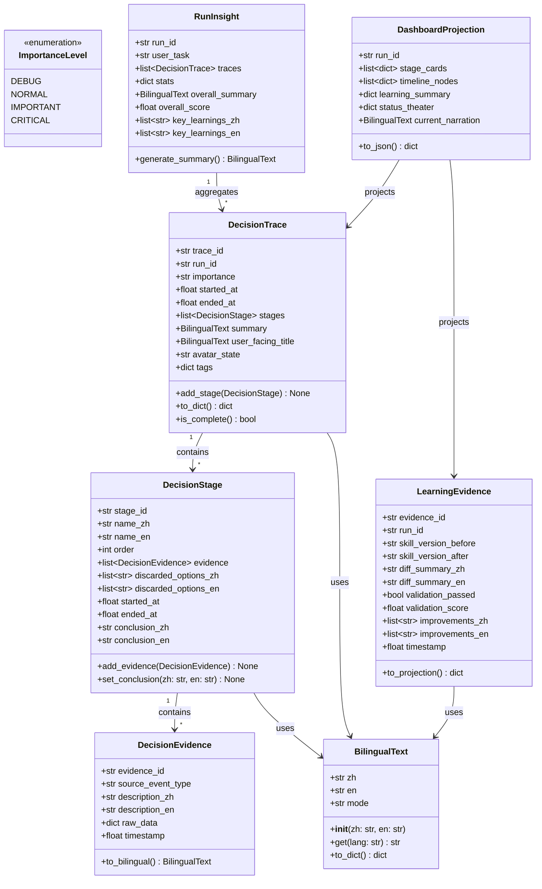
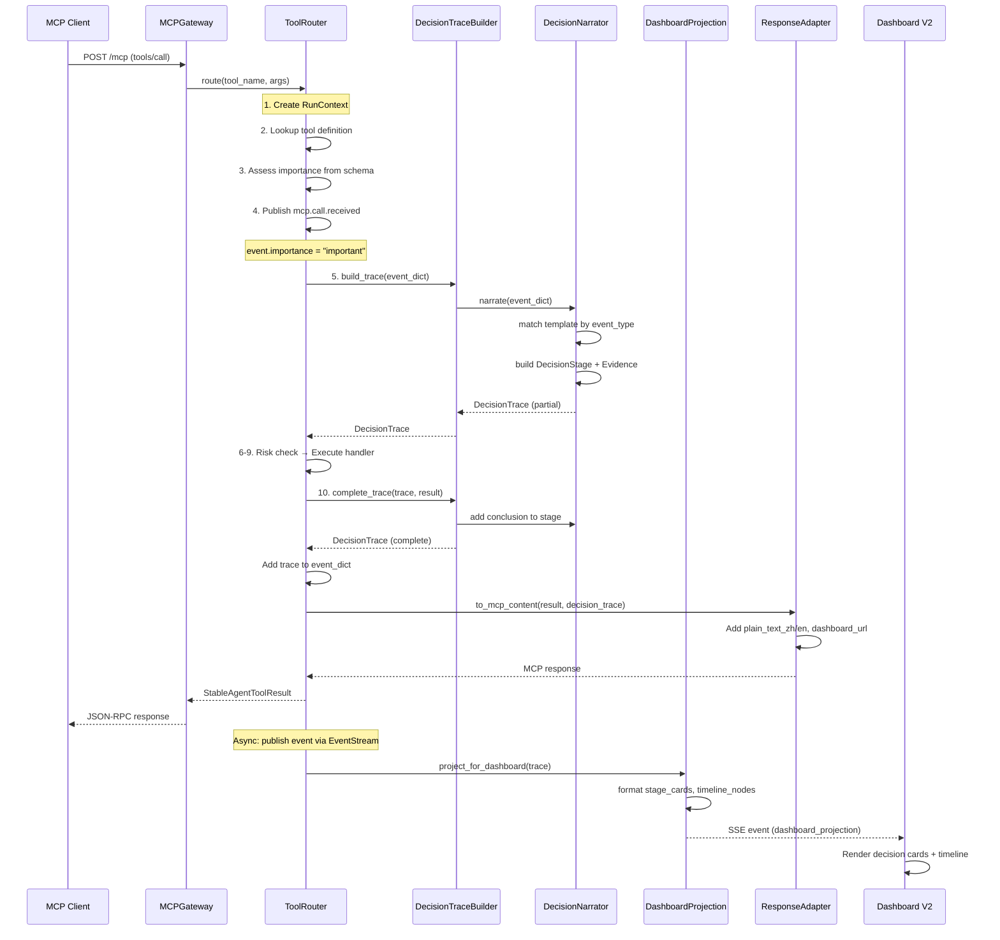
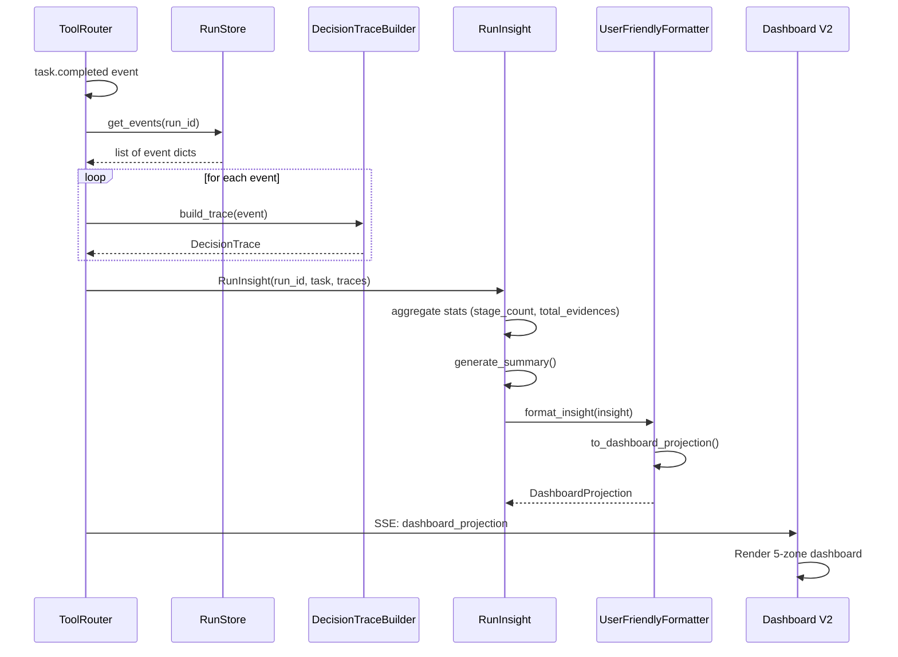
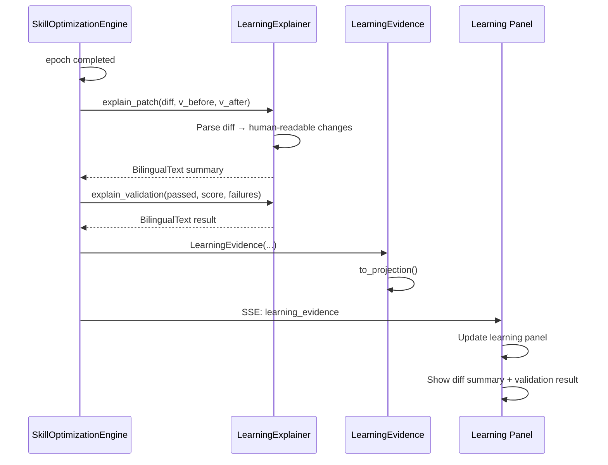
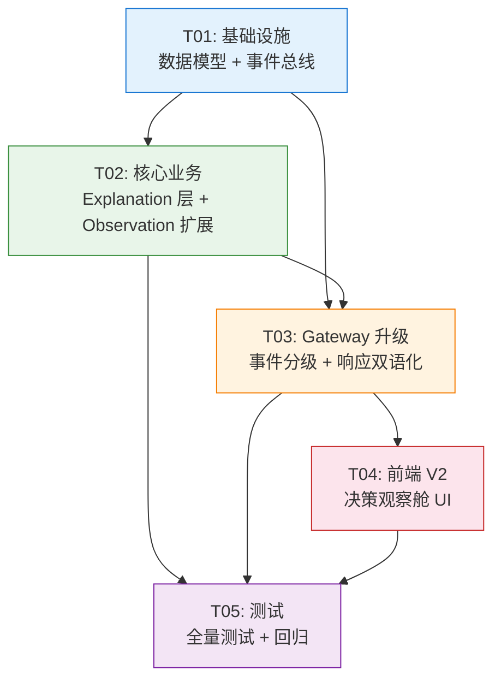

# StableAgent OS V5.5 — 决策观察舱 系统设计文档

> **设计者**：Bob (Architect)
> **日期**：2025-05-28
> **目标**：将现有 Dashboard（技术日志面板）升级为"用户可读的决策观察舱"

---

## 目录

1. [Part A: 系统设计](#part-a-系统设计)
   - [1. 实现方案](#1-实现方案)
   - [2. 文件清单](#2-文件清单)
   - [3. 数据结构与接口](#3-数据结构与接口)
   - [4. 程序调用流](#4-程序调用流)
   - [5. 未明确事项](#5-未明确事项)
2. [Part B: 任务分解](#part-b-任务分解)
   - [6. 依赖包](#6-依赖包)
   - [7. 任务清单](#7-任务清单)
   - [8. 共享知识](#8-共享知识)
   - [9. 任务依赖图](#9-任务依赖图)

---

## Part A: 系统设计

### 1. 实现方案

#### 1.1 核心技术挑战

| 挑战 | 描述 | 严重度 |
|------|------|--------|
| **事件→决策翻译** | V5 事件（tool.started/failed）是技术性的，需要翻译为用户可理解的"决策过程" | 高 |
| **双语输出** | 所有解释需同时支持中文/English/双语，且不破坏现有 plain_text 字段 | 高 |
| **后端兼容性** | 新增字段（importance、plain_text_zh/en、decision_trace）不能破坏现有消费者 | 中 |
| **前端渐进升级** | dashboard_v2.html 需与 dashboard.html 共存，共享 WebSocket/SSE 基础设施 | 中 |
| **SkillOpt 可解释性** | 学习结果（patch diff、验证通过/失败）需转化为用户可读的"学到了什么" | 中 |

#### 1.2 架构模式

```
┌─────────────────────────────────────────────────────────────┐
│                      V5.5 决策观察舱                          │
│                                                              │
│  ┌──────────┐   ┌──────────────┐   ┌───────────────────┐   │
│  │ Gateway  │──▶│ observation/ │──▶│ explanation/       │   │
│  │ (升级)   │   │ (扩展)       │   │ (新增)            │   │
│  │          │   │              │   │                   │   │
│  │ tool_    │   │ decision_   │   │ decision_narrator │   │
│  │ router   │   │ trace.py    │   │ bilingual_text    │   │
│  │ +import. │   │ builder.py  │   │ templates         │   │
│  │ +trace   │   │ run_insight │   │ stage_explainer   │   │
│  │          │   │ dashboard_  │   │ evidence_summar.  │   │
│  │ response │   │ projection  │   │ learning_explainer│   │
│  │ adapter  │   │ learning_   │   │ user_friendly_    │   │
│  │ +zh/en   │   │ evidence    │   │ formatter         │   │
│  └──────────┘   └──────────────┘   └───────────────────┘   │
│        │                │                    │               │
│        ▼                ▼                    ▼               │
│  ┌──────────────────────────────────────────────────────┐   │
│  │                  web/ 前端 V2                          │   │
│  │  dashboard_v2.html  dashboard_v2.js  avatar_scene.js │   │
│  │  i18n.js  decision_timeline.js  learning_panel.js    │   │
│  │  styles_v2.css                                        │   │
│  └──────────────────────────────────────────────────────┘   │
└─────────────────────────────────────────────────────────────┘
```

**架构模式**：Pipeline 模式 — Gateway 产生事件 → Observation 扩展构建 DecisionTrace → Explanation 翻译为用户可读文本 → 前端渲染。

#### 1.3 框架与库选择

| 组件 | 选型 | 理由 |
|------|------|------|
| 后端 | 纯 Python（无新依赖） | V5 已有 FastAPI，无需引入新框架 |
| 数据模型 | `@dataclass` | 与 V5 models.py 风格一致 |
| 双语 | 自定义 BilingualText | 轻量，无需 i18n 库，直接支持 zh/en/both |
| 前端 | 原生 JS + CSS | 与 V5 dashboard.html 一致，无框架依赖 |
| 前端布局 | CSS Grid + Flexbox | 5 区布局天然适合 Grid |
| 样式 | Apple 克制风格 | 低饱和度、大留白、SF 字体栈 |

---

### 2. 文件清单

```
stable_agent/
├── models.py                              # [修改] 新增 V5.5 数据类
├── trace_event_bus.py                     # [修改] 事件增加 importance + 双语字段
├── observation/
│   ├── __init__.py                        # [修改] 导出新类
│   ├── event_stream.py                    # [不变]
│   ├── run_store.py                       # [不变]
│   ├── dashboard_sync.py                  # [不变]
│   ├── decision_trace.py                  # [新增] DecisionTrace 数据模型
│   ├── decision_trace_builder.py          # [新增] 从 event 构建 DecisionTrace
│   ├── run_insight.py                     # [新增] RunInsight 任务总结
│   ├── learning_evidence.py               # [新增] SkillOpt 学习证据
│   └── dashboard_projection.py            # [新增] DecisionTrace → 前端投影
├── explanation/                           # [新增] 解释层子包
│   ├── __init__.py
│   ├── bilingual_text.py                  # [新增] BilingualText + I18nManager
│   ├── explanation_templates.py           # [新增] 事件→模板映射
│   ├── decision_narrator.py               # [新增] 技术事件→DecisionTrace 翻译
│   ├── stage_explainer.py                 # [新增] DecisionStage 解释
│   ├── evidence_summarizer.py             # [新增] 证据/废弃摘要
│   ├── learning_explainer.py              # [新增] SkillOpt 学习结果解释
│   └── user_friendly_formatter.py         # [新增] 前端投影格式化
├── gateway/
│   ├── mcp_gateway.py                     # [修改] 响应增加 plain_text_zh/en, dashboard_url
│   ├── tool_router.py                     # [修改] 事件增加 importance + DecisionTrace 生成
│   ├── response_adapter.py                # [修改] structuredContent 扩展
│   ├── tool_schemas.py                    # [修改] 工具 importance 分级
│   ├── run_context.py                     # [不变]
│   ├── jsonrpc_handler.py                 # [不变]
│   └── unified_tool_registry.py           # [不变]
├── dashboard.py                           # [修改] 新增 /api/v2/* 端点
web/
├── server.py                              # [修改] 挂载 V2 静态路由
├── static/
│   ├── pixel_avatar.js                    # [不变] V5 角色引擎
│   ├── dashboard_v2.html                  # [新增] V2 5区布局
│   ├── dashboard_v2.js                    # [新增] V2 主控制器
│   ├── avatar_scene.js                    # [新增] 语义角色动画
│   ├── i18n.js                            # [新增] 前端 i18n
│   ├── decision_timeline.js               # [新增] 决策时间线
│   ├── learning_panel.js                  # [新增] 学习面板
│   └── styles_v2.css                      # [新增] Apple 风格
tests/
├── test_v55_models.py                     # [新增] V5.5 数据模型测试
├── test_v55_bilingual.py                  # [新增] 双语文本测试
├── test_v55_explanation.py                # [新增] 解释层测试
├── test_v55_decision_trace.py             # [新增] DecisionTrace 测试
├── test_v55_gateway_v55.py                # [新增] Gateway V5.5 升级测试
├── test_v55_dashboard_projection.py       # [新增] 前端投影测试
├── test_v55_learning_evidence.py          # [新增] 学习证据测试
└── test_v55_integration.py                # [新增] 端到端集成测试
```

---

### 3. 数据结构与接口

#### 3.1 核心数据模型



#### 3.2 Explanation 服务层

```mermaid
classDiagram
    class I18nManager {
        -str _current_lang
        +set_lang(lang: str) None
        +get_lang() str
        +render(text: BilingualText) str
    }

    class ExplanationTemplates {
        -dict~str,dict~ _templates
        +get_template(event_type: str, lang: str) str
        +register(event_type: str, zh: str, en: str) None
    }

    class DecisionNarrator {
        -ExplanationTemplates _templates
        -I18nManager _i18n
        +narrate(event_dict: dict) DecisionTrace
        +translate_stage(event_type: str) DecisionStage
        +build_evidence(payload: dict, event_type: str) DecisionEvidence
    }

    class StageExplainer {
        -ExplanationTemplates _templates
        +explain(stage: DecisionStage, lang: str) str
        +explain_evidence(evidence: DecisionEvidence, lang: str) str
        +explain_discarded(discarded: list, lang: str) str
    }

    class EvidenceSummarizer {
        +summarize(evidences: list~DecisionEvidence~, lang: str) str
        +rank_by_importance(evidences: list~DecisionEvidence~) list
        +deduplicate(evidences: list~DecisionEvidence~) list
    }

    class LearningExplainer {
        -I18nManager _i18n
        +explain_patch(diff: str, before_version: str, after_version: str) BilingualText
        +explain_validation(passed: bool, score: float, failures: list) BilingualText
        +summarize_epoch(evidences: list~LearningEvidence~) BilingualText
    }

    class UserFriendlyFormatter {
        +format_trace(trace: DecisionTrace) dict
        +format_insight(insight: RunInsight) dict
        +format_learning(evidence: LearningEvidence) dict
        +to_dashboard_projection(insight: RunInsight, learnings: list) DashboardProjection
    }

    DecisionNarrator --> ExplanationTemplates : uses
    DecisionNarrator --> I18nManager : uses
    StageExplainer --> ExplanationTemplates : uses
    LearningExplainer --> I18nManager : uses
    UserFriendlyFormatter --> DashboardProjection : produces
```



#### 3.3 事件结构扩展

V5.5 事件字典新增字段（在 tool_router._make_event_dict 中）：

```python
# V5 已有字段
{
    "run_id": str,
    "tool_call_id": str,
    "trace_id": str,
    "span_id": str,
    "parent_span_id": str,
    "event_type": str,
    "timestamp": float,
    "payload": dict,
    "plain_text": str,
    "avatar_state": str,
    # V5.5 新增字段
    "importance": str,          # "debug"|"normal"|"important"|"critical"
    "plain_text_zh": str,       # 中文解释
    "plain_text_en": str,       # 英文解释
    "decision_trace": dict|None, # DecisionTrace.to_dict() 或 None
    "dashboard_url": str,        # V2 Dashboard URL（如 "/dashboard/v2/runs/{run_id}"）
}
```

#### 3.4 ResponseAdapter 扩展

`structuredContent` 新增字段：

```python
{
    "ok": bool,
    "run_id": str,
    "tool_name": str,
    "data": dict,
    "warnings": list,
    "next_actions": list,
    "trace_url": str,
    # V5.5 新增
    "plain_text_zh": str,       # 中文结果文本
    "plain_text_en": str,       # 英文结果文本
    "dashboard_url": str,       # V2 Dashboard URL
    "importance": str,          # 事件重要性
}
```

---

### 4. 程序调用流

#### 4.1 工具调用 → 决策观察舱（完整链路）



#### 4.2 RunInsight 任务总结生成



#### 4.3 学习证据生成（SkillOpt Epoch 完成时）



---

### 5. 未明确事项

| # | 事项 | 假设 | 风险 |
|---|------|------|------|
| 1 | `importance` 分级依据 | 根据 tool_schemas 中的 risk_level + 事件类型自动判定：forbidden→critical, high→important, medium→normal, low→debug | 低 |
| 2 | `plain_text_zh/en` 生成策略 | explanation 层用模板 + 参数填充生成，不依赖 LLM | 模板覆盖不全时回退到 plain_text |
| 3 | Dashboard V2 与 V1 共存方式 | `/dashboard/` 指向 V1，`/dashboard/v2/` 指向 V2；SSE 端点复用 `/mcp?run_id=` | V1 用户不受影响 |
| 4 | `avatar_state` 语义扩展 | V5 已有 15 个 avatar_state 值，V5.5 不增加新值但通过 decision_trace.stages 提供更丰富语义 | 前端使用现有 V5_AVATAR_STATES 映射 |
| 5 | DecisionTrace 存储 | 仅内存（RunStore），不持久化到 JSONL；但通过 SSE 实时推送到前端 | 刷新页面后丢失历史，需从 events 重放重建 |
| 6 | 双语切换的触发方式 | 前端 i18n.js 管理，默认跟随浏览器语言；URL 参数 `?lang=zh/en/both` 可覆盖 | 后端 BilingualText 始终包含 zh+en，前端按需渲染 |
| 7 | 5 区布局的具体内容 | 状态剧场=avatar+状态标签，决策卡片=当前 DecisionStage，时间线=DecisionTrace 节点，学习面板=LearningEvidence 列表，抽屉=RunInsight 详情 | 需 UI 确认 |

---

## Part B: 任务分解

### 6. 依赖包

V5.5 不引入新的第三方依赖，完全复用 V5 已有依赖：

```
- Python 3.11+: 运行时
- fastapi: Web 框架（已有）
- uvicorn: ASGI 服务器（已有）
- pytest>=7.0: 测试框架（已有）
```

前端依赖均为零依赖原生实现：

```
- 无 npm 包依赖（纯 HTML/CSS/JS）
- 复用 V5 的 pixel_avatar.js
```

### 7. 任务清单

#### T01: 基础设施 — 数据模型层 + 事件总线升级

**Task ID**: T01
**Task Name**: V5.5 数据模型与事件总线升级
**Source Files**:
- `stable_agent/models.py` — 新增 BilingualText、ImportanceLevel、DecisionEvidence、DecisionStage、DecisionTrace、RunInsight、LearningEvidence、DashboardProjection 数据类
- `stable_agent/trace_event_bus.py` — 事件发布增加 importance、plain_text_zh、plain_text_en、decision_trace、dashboard_url 字段支持
- `stable_agent/observation/decision_trace.py` — 新建，DecisionTrace 及相关数据模型专用模块（从 models 导入并扩展构建逻辑）
- `stable_agent/explanation/__init__.py` — 新建，导出 explanation 子包公共 API
- `tests/test_v55_models.py` — 新建，覆盖所有新数据类
**Dependencies**: 无（纯新增，不修改现有行为）
**Priority**: P0
**描述**:
1. 在 `models.py` 中新增 8 个 `@dataclass`（遵循 V5 约定：类型注解 + 默认值 + `__post_init__` 验证）
2. `BilingualText` 支持 `zh`/`en`/`both` 三种 mode，`get(lang)` 方法按语言返回
3. `ImportanceLevel` 用 `StrEnum`：`DEBUG`/`NORMAL`/`IMPORTANT`/`CRITICAL`
4. `DecisionTrace.to_dict()` 递归序列化 stages→evidences
5. `trace_event_bus.py` 的 `Event` 数据类新增可选字段（向后兼容），`_make_event_dict` 新增参数
6. `observation/decision_trace.py` 包含辅助工厂方法 `from_event_dict()`

#### T02: 核心业务 — Explanation 层 + Observation 扩展

**Task ID**: T02
**Task Name**: 解释引擎与决策追踪构建
**Source Files**:
- `stable_agent/explanation/bilingual_text.py` — BilingualText + I18nManager 实现
- `stable_agent/explanation/explanation_templates.py` — 事件→模板映射表（覆盖 V5 全部 30+ 事件）
- `stable_agent/explanation/decision_narrator.py` — 核心翻译器：event_dict → DecisionTrace
- `stable_agent/explanation/stage_explainer.py` — DecisionStage 中文/英文解释生成
- `stable_agent/explanation/evidence_summarizer.py` — 证据去重+排序+摘要
- `stable_agent/explanation/learning_explainer.py` — SkillOpt 学习结果→人类可读文本
- `stable_agent/explanation/user_friendly_formatter.py` → DashboardProjection 格式化
- `stable_agent/observation/decision_trace_builder.py` — 逐步构建 DecisionTrace（支持 start_stage/end_stage）
- `stable_agent/observation/run_insight.py` — RunInsight 聚合生成
- `stable_agent/observation/learning_evidence.py` — LearningEvidence 构建与 diff 摘要
- `stable_agent/observation/dashboard_projection.py` — DecisionTrace→前端投影（stage_cards + timeline_nodes）
- `stable_agent/observation/__init__.py` — 更新导出
- `tests/test_v55_bilingual.py` — 双语测试
- `tests/test_v55_explanation.py` — 解释引擎测试
- `tests/test_v55_decision_trace.py` — DecisionTrace 构建测试
**Dependencies**: T01（需要 DecisionTrace、BilingualText 等数据模型）
**Priority**: P0
**描述**:
1. `I18nManager` 为进程级单例，管理当前语言上下文
2. `explanation_templates.py` 覆盖所有 V5 事件类型 + V5.5 新增的 decision trace 事件
3. `decision_narrator.py` 是核心：接收 tool_router 产生的 event_dict，匹配模板，创建 DecisionTrace（含 DecisionStage + DecisionEvidence）
4. `decision_trace_builder.py` 提供 Builder 模式：逐步添加 stage → 添加 evidence → 设置 conclusion → build()
5. `run_insight.py` 在 task.completed 时聚合所有 traces 生成总结
6. `learning_explainer.py` 解析 SkillOpt patch diff 为可读的"学到了什么"

#### T03: Gateway 升级 — 事件分级 + 响应双语化

**Task ID**: T03
**Task Name**: MCP Gateway V5.5 升级
**Source Files**:
- `stable_agent/gateway/tool_router.py` — `_make_event_dict` 增加 importance/plain_text_zh/plain_text_en/decision_trace；route() 中集成 DecisionTraceBuilder
- `stable_agent/gateway/response_adapter.py` — `to_mcp_content` 的 structuredContent 增加 plain_text_zh/en、dashboard_url、importance
- `stable_agent/gateway/mcp_gateway.py` — 注入 DecisionTraceBuilder 到 ToolRouter；添加 `/dashboard/v2/` 路由
- `stable_agent/gateway/tool_schemas.py` — 为每个工具增加 `importance` 字段（默认 "normal"）
- `stable_agent/dashboard.py` — 新增 `/api/v2/run/{run_id}/insight`、`/api/v2/skillopt/learning_evidence` 端点
- `tests/test_v55_gateway_v55.py` — Gateway 升级测试
- `tests/test_v55_dashboard_projection.py` — 投影测试
**Dependencies**: T01、T02（需要 DecisionTraceBuilder、DecisionNarrator）
**Priority**: P0
**描述**:
1. `_make_event_dict` 签名扩展，增加 `importance`、`plain_text_zh`、`plain_text_en`、`decision_trace` 参数
2. `importance` 默认值根据 risk_level 推断：forbidden→critical, high→important, medium→normal, low→debug
3. `plain_text_zh/en` 从 `explanation_templates` 中查找对应事件类型的模板并填充
4. `route()` 方法在 tool.completed 事件发布后，调用 `decision_trace_builder.complete_trace()` 生成完整 DecisionTrace
5. `response_adapter` 在 `structuredContent` 中新增 `plain_text_zh`、`plain_text_en`、`dashboard_url`、`importance`
6. `dashboard_url` 格式：`/dashboard/v2/runs/{run_id}`
7. 新增 REST 端点供前端 V2 拉取历史数据

#### T04: 前端 V2 — 决策观察舱 UI

**Task ID**: T04
**Task Name**: Dashboard V2 前端实现
**Source Files**:
- `web/static/dashboard_v2.html` — 5 区布局（状态剧场 + 决策卡片 + 时间线 + 学习面板 + 抽屉）
- `web/static/dashboard_v2.js` — 主控制器（SSE 连接、数据路由、区域更新）
- `web/static/avatar_scene.js` — 语义角色场景（笔记墙/书架/算盘/地图/安全帽/试卷/技能书 7 个场景）
- `web/static/i18n.js` — 前端语言切换（中文/English/双语），支持 URL 参数 `?lang=`
- `web/static/decision_timeline.js` — 关键决策节点时间线组件
- `web/static/learning_panel.js` — 自我优化证据面板（显示 diff 摘要 + 验证结果）
- `web/static/styles_v2.css` — Apple 克制风格（SF 字体栈、大留白、低饱和度配色）
- `web/server.py` — 新增 `/dashboard/v2/` 静态路由挂载
- `web/templates/dashboard_v2.html` — Jinja2 模板（可选，用于动态注入 run_id）
**Dependencies**: T03（需要后端 API 端点确定，但可先用 mock 数据并行开发）
**Priority**: P1
**描述**:
1. **5 区布局**：CSS Grid `grid-template-areas` 定义
   - `status-theater`：左侧，Canvas 像素角色 + 语义场景切换 + 当前状态标签
   - `decision-cards`：中央上方，当前决策阶段卡片（Stage 标题 + 证据列表 + 结论）
   - `timeline`：中央下方，关键决策节点时间线（垂直滚动）
   - `learning-panel`：右侧，SkillOpt 学习证据（patch 摘要 + 验证结果）
   - `drawer`：底部抽屉，RunInsight 完整详情（点击展开）
2. **avatar_scene.js**：不修改 pixel_avatar.js，在其之上新增 7 个语义场景 layer（canvas 叠加）
   - 笔记墙 (note_wall)：记忆检索时显示
   - 书架 (bookshelf)：RAG 检索时显示
   - 算盘 (abacus)：预算估算时显示
   - 地图 (map)：规划时显示
   - 安全帽 (helmet)：安全检查时显示
   - 试卷 (exam)：评估时显示
   - 技能书 (skill_book)：SkillOpt 学习时显示
3. **i18n.js**：前端语言管理器，监听 `?lang=zh/en/both`，切换时重新渲染所有 BilingualText 节点
4. **SSE 消费**：复用 V5 的 `/mcp?run_id=` SSE 端点，解析 `decision_trace` 和 `dashboard_projection` 字段
5. **响应式**：桌面端 5 区全显示，平板端 2 列，手机端单列堆叠

#### T05: 测试与集成验证

**Task ID**: T05
**Task Name**: V5.5 全量测试与回归验证
**Source Files**:
- `tests/test_v55_models.py` — 补充边界条件（已在 T01 创建骨架）
- `tests/test_v55_bilingual.py` — 补充 I18nManager 并发测试
- `tests/test_v55_explanation.py` — 补充模板覆盖率测试
- `tests/test_v55_decision_trace.py` — 补充完整生命周期测试
- `tests/test_v55_gateway_v55.py` — 补充 end-to-end Gateway 测试
- `tests/test_v55_dashboard_projection.py` — 补充前端投影格式验证
- `tests/test_v55_learning_evidence.py` — 学习证据测试
- `tests/test_v55_integration.py` — 端到端：提交任务 → 观察 SSE → 验证 DecisionTrace → 验证投影
- 回归：运行全部 33 个已有测试（`pytest tests/ -x -q`）
**Dependencies**: T01, T02, T03, T04
**Priority**: P1
**描述**:
1. 模型测试：BilingualText 各 mode 输出、DecisionTrace.to_dict 递归正确性、ImportanceLevel 枚举值
2. 双语测试：I18nManager 线程安全、模板 zh/en 完整性校验（所有事件类型必须有双语模板）
3. 解释引擎测试：给定 event_dict 输入，验证 DecisionTrace 输出结构正确
4. Gateway 集成测试：Mock tool call → 验证 response 包含 `plain_text_zh/en`、`dashboard_url`
5. 投影测试：DashboardProjection 的 stage_cards 和 timeline_nodes 格式验证
6. **回归测试**：全部 33 个已有测试必须通过，确保 V5 行为不受影响

### 8. 共享知识

跨任务约定，供 Engineer 参考：

```
- 所有 BilingualText 实例同时包含 zh 和 en 字段，前端按需渲染
- 事件 importance 默认值：debug（调试事件）、normal（常规工具调用）、important（高风险/任务开始结束）、critical（安全拒绝/系统错误）
- DecisionTrace 通过 SSE 实时推送，不做持久化（刷新页面后从 events 重放重建）
- dashboard_url 格式统一为 "/dashboard/v2/runs/{run_id}"
- 所有 API 响应保持 V5 格式：{code, data, message} 或 MCP JSON-RPC 格式
- 模板键格式："{event_type}.stage_name" / "{event_type}.evidence" / "{event_type}.conclusion"
- 前端 CSS 使用 CSS 自定义属性（--color-*），不硬编码颜色值
- 像素角色 Canvas 尺寸 16x16，SCALE=4，7 个语义场景作为独立 Canvas 叠加层
- V1 Dashboard 路径不变（/dashboard/），V2 路径为 /dashboard/v2/
```

### 9. 任务依赖图



**并行化机会**：T04 可在 T01 完成后与 T02/T03 并行开发（使用 mock SSE 数据），实际交付时再对接 T03 的真实 API。

---

## 集成风险矩阵

| 风险 | 影响 | 缓解措施 |
|------|------|----------|
| **Event 字典新增字段破坏现有消费者** | 高 | 所有新字段为可选（`dict.get(key, default)`），旧代码不受影响 |
| **模板覆盖不全导致双语缺失** | 中 | `explanation_templates` 提供 `_DEFAULT` 兜底模板；plain_text 作为 fallback |
| **DecisionTrace 构建增加工具调用延迟** | 低 | 构建操作均为纯字典/对象操作（<1ms），不影响性能 |
| **V1/V2 Dashboard 路由冲突** | 低 | V2 使用独立路径 `/dashboard/v2/`，SSE 端点复用 |
| **pixel_avatar.js 修改回归** | 中 | **不修改 pixel_avatar.js**，avatar_scene.js 作为叠加层独立运行 |
| **SkillOpt patch diff 可读性差** | 中 | learning_explainer 使用规则提取（新增/删除/修改行数）+ 关键词高亮 |
