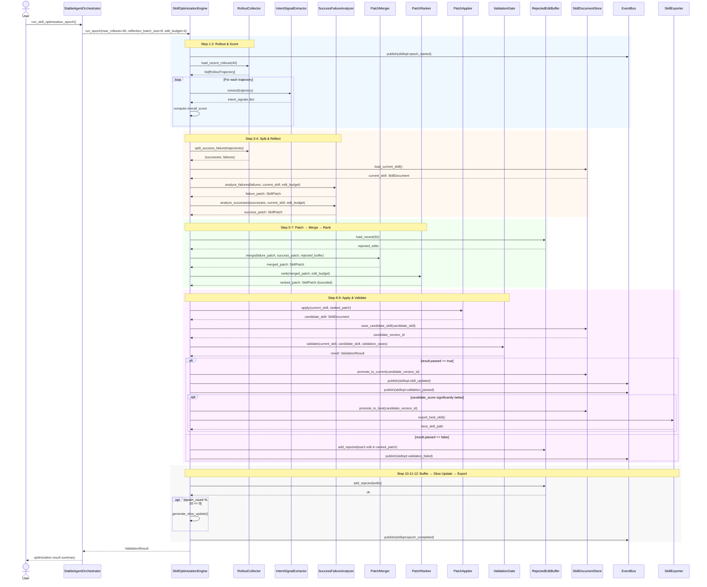
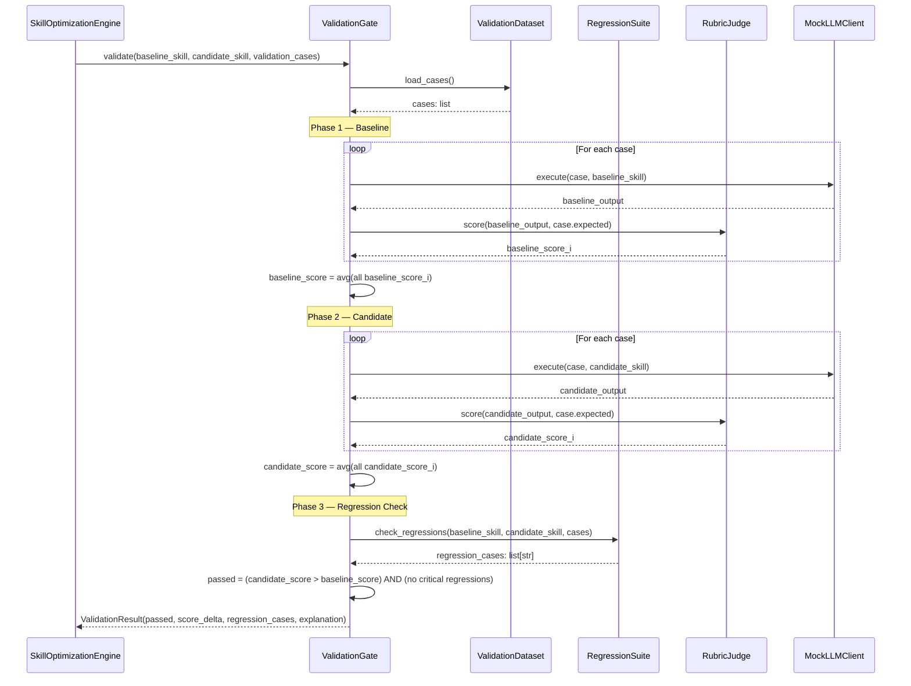
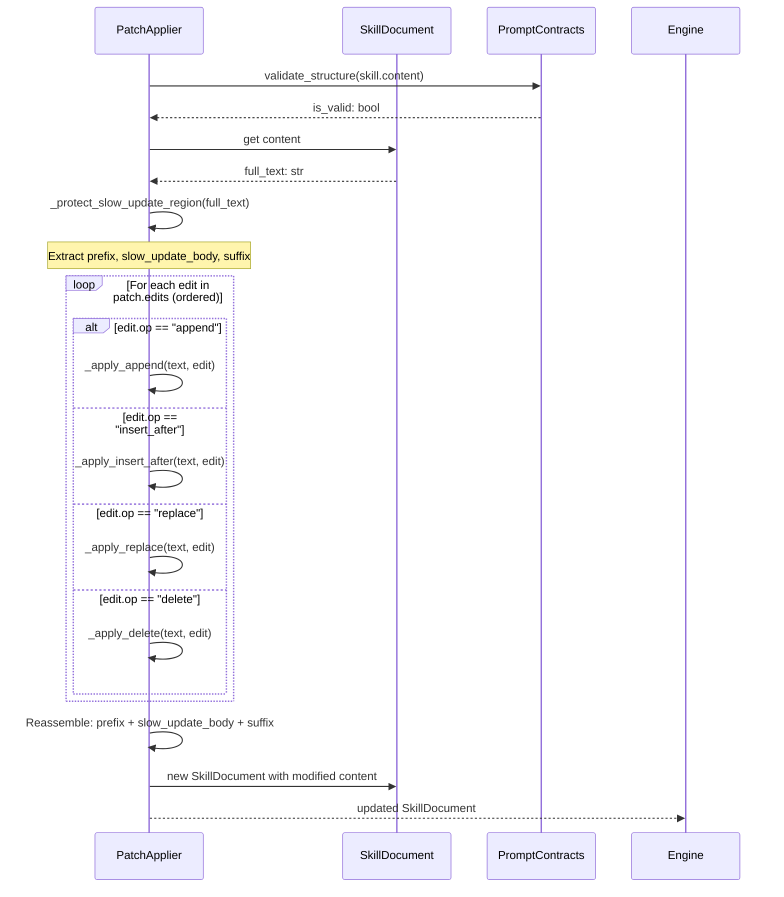
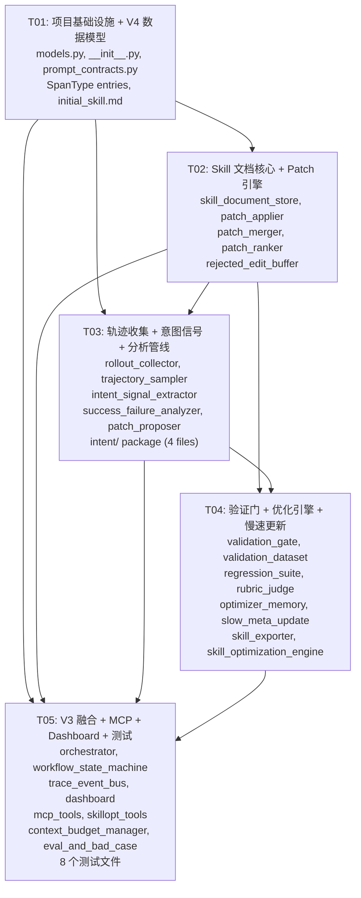

# StableAgent OS V4 — 系统设计文档

> **作者**: Bob (Architect)
> **版本**: 0.1.0
> **日期**: 2025-05-28
> **依赖**: V3 代码库（37 Python 文件，14 测试文件，348/348 测试通过）

---

## Part A: 系统设计

### 1. Implementation Approach

#### 1.1 核心技术挑战

| 挑战 | 分析 | 策略 |
|------|------|------|
| **自迭代闭环** | 12 步优化循环需要可靠的状态管理，不能丢失中间产物 | 复用 V3 的 `WorkflowState` 模式，新增 `SkillOptWorkflowState` 枚举 + JSONL 持久化 |
| **Patch 安全性** | 错误的 skill 编辑可能破坏已有有效规则 | 严格 Validation Gate：`candidate_score > baseline_score` 才通过，平分不通过 |
| **Skill vs Memory 边界** | 两者都是"学习到的知识"，但粒度不同 | Skill 是全局规则文档（自然语言），Memory 是细粒度事实条目。保持两套存储独立 |
| **文本编辑精度** | 自然语言文档的 `replace/insert_after/delete` 需要准确定位 | 使用标记锚点（如 `## Section Name`）+ 行号偏移，不需要 diff 算法 |
| **反馈信号稀疏** | 用户不总会给 explicit feedback | `user_feedback` 默认 `unknown`；显性信号（accepted/rejected）优先于评分推断 |
| **与 V3 系统的融合** | 不能破坏 348 个已有测试 | 所有 V3 模块采用"追加模式"修改：新增枚举值、新增方法、新增可选参数；不删除/重命名任何现有接口 |

#### 1.2 框架与库选择

| 组件 | 选择 | 理由 |
|------|------|------|
| 数据模型 | `@dataclass` | 与 V3 一致，零额外依赖 |
| 持久化 | SQLite (sqlite3) | 复用 V3 `StableAgentStorage`，新增表 |
| 事件系统 | 现有 `EventBus` | 新增 `skillopt.*` 事件类型 |
| 状态机 | 现有 `WorkflowEngine` 模式 | 新增 `SKILL_OPTIMIZATION_WORKFLOW` 状态组 |
| 文档存储 | 文件系统 (.md + .jsonl) | Skill 文档天然是 Markdown，版本历史用 JSONL |
| 测试框架 | pytest（与 V3 一致） | 全部测试放在 `tests/` 目录 |

#### 1.3 架构模式

```
┌──────────────────────────────────────────────────────┐
│                  StableAgentOrchestrator              │
│  ┌──────────────┐  ┌─────────────────────────────┐   │
│  │ V3 Workflow  │  │ V4 SkillOptimizationEngine  │   │
│  │   Engine     │  │  (新增，独立引擎)             │   │
│  └──────────────┘  └──────────────┬──────────────┘   │
│                                    │                   │
│         ┌──────────────────────────┼───────┐          │
│         │     skill_optimizer/     │intent/│          │
│         │  17 个模块组成优化流水线   │4 模块 │          │
│         └──────────────────────────┴───────┘          │
│                                    │                   │
│         ┌──────────────────────────┼───────┐          │
│         │  mcp/skillopt_tools.py   │ evals/│          │
│         │  10 个 MCP 工具           │3 模块 │          │
│         └──────────────────────────┴───────┘          │
└──────────────────────────────────────────────────────┘
```

**核心设计决策**：
- SkillOptimizationEngine 是独立引擎，不嵌入 WorkflowEngine 内部
- 通过 `skillopt.*` 事件与现有 EventBus 通信
- 通过 `StableAgentStorage` 新增表进行持久化
- Skill 文档版本管理通过文件系统 + JSONL 实现

---

### 2. File List

#### 2.1 新增目录与文件（48 个文件）

```
stable_agent/
  skill_optimizer/                    # 新建包
    __init__.py                       # 包初始化，导出核心类
    models.py                         # V4 数据模型（SkillDocument, RolloutTrajectory, SkillEdit, SkillPatch, ValidationResult）
    skill_document_store.py           # SkillDocumentStore — 文档 CRUD + 版本管理
    rollout_collector.py              # RolloutCollector — 轨迹收集与成功/失败拆分
    trajectory_sampler.py             # TrajectorySampler — 轨迹抽样策略
    intent_signal_extractor.py        # IntentSignalExtractor — 意图信号提取
    success_failure_analyzer.py       # SuccessFailureAnalyzer — 成功/失败模式分析
    patch_proposer.py                 # PatchProposer — 单个编辑提案生成
    patch_merger.py                   # PatchMerger — 编辑合并与冲突解决
    patch_ranker.py                   # PatchRanker — 编辑排序
    patch_applier.py                  # PatchApplier — 编辑应用
    validation_gate.py                # ValidationGate — 验证门
    rejected_edit_buffer.py           # RejectedEditBuffer — 被拒绝编辑缓冲
    slow_meta_update.py               # SlowMetaUpdater — 慢速元更新
    optimizer_memory.py               # OptimizerMemory — 优化器自省记忆
    skill_exporter.py                 # SkillExporter — 导出 best_skill.md
    skill_optimization_engine.py      # SkillOptimizationEngine — 优化总控
    prompt_contracts.py               # PromptContracts — Skill prompt 结构契约

  intent/                             # 新建包
    __init__.py                       # 包初始化
    user_intent_profile.py            # UserIntentProfile — 用户意图画像
    intent_taxonomy.py                # IntentTaxonomy — 意图分类体系
    intent_alignment_evaluator.py     # IntentAlignmentEvaluator — 意图对齐评估
    preference_drift_detector.py      # PreferenceDriftDetector — 偏好漂移检测

  evals/                              # 新建包
    __init__.py                       # 包初始化
    validation_dataset.py             # ValidationDataset — 验证数据集管理
    regression_suite.py               # RegressionSuite — 回归测试套件
    rubric_judge.py                   # RubricJudge — 评分准则判定

  mcp/
    skillopt_tools.py                 # 新建：10 个 SkillOpt MCP 工具

skills/                               # 新建数据目录（项目根）
  initial_skill.md                    # 初始技能文档模板
  best_skill.md                       # 当前最优技能文档（导出目标）

data/                                 # 扩展已有目录
  rollouts/                           # 新建：轨迹数据目录
  validation/                         # 新建：验证数据目录
  eval_results/                       # 新建：评估结果目录
  skill_versions/                     # 新建：skill 版本 JSONL
  rejected_edits.jsonl                # 新建：被拒绝编辑日志
  optimizer_meta_skill.md             # 新建：优化器元技能

tests/                                # 扩展已有目录
  test_skill_document_store.py        # 新建
  test_patch_applier.py               # 新建
  test_validation_gate.py             # 新建
  test_rejected_edit_buffer.py        # 新建
  test_skill_optimization_engine.py   # 新建
  test_intent_signal_extractor.py     # 新建
  test_mcp_skillopt_tools.py          # 新建
  test_dashboard_skillopt_events.py   # 新建
```

#### 2.2 修改的现有文件（8 个）

```
stable_agent/models.py                # 新增 V4 枚举 + 数据类
stable_agent/orchestrator.py          # 实例化 SkillOptimizationEngine
stable_agent/workflow_state_machine.py # 新增 SKILL_OPTIMIZATION_WORKFLOW 状态
stable_agent/trace_event_bus.py       # 新增 skillopt.* 事件类型
stable_agent/dashboard.py             # 新增 6 个 skill 学习状态解释 + 端点
stable_agent/mcp_tools.py             # 新增 10 个 skillopt 工具注册
stable_agent/context_budget_manager.py # 新增 skill_token_size 等预算参数
stable_agent/eval_and_bad_case.py     # BadCase → RolloutTrajectory 自动转化
```

---

### 3. Data Structures and Interfaces

#### 3.1 V4 新增枚举

```python
class SkillDocumentStatus(StrEnum):
    DRAFT = "draft"
    CURRENT = "current"
    BEST = "best"
    REJECTED = "rejected"
    ARCHIVED = "archived"

class SkillEditOp(StrEnum):
    APPEND = "append"
    INSERT_AFTER = "insert_after"
    REPLACE = "replace"
    DELETE = "delete"

class SkillEditSourceType(StrEnum):
    FAILURE = "failure"
    SUCCESS = "success"
    SLOW_UPDATE = "slow_update"
    MANUAL = "manual"

class SkillOptWorkflowState(StrEnum):
    """Skill 优化工作流 11 个状态"""
    IDLE = "skillopt_idle"
    COLLECTING = "skillopt_collecting"
    SCORING = "skillopt_scoring"
    SPLITTING = "skillopt_splitting"
    REFLECTING = "skillopt_reflecting"
    PATCHING = "skillopt_patching"
    MERGING = "skillopt_merging"
    RANKING = "skillopt_ranking"
    APPLYING = "skillopt_applying"
    VALIDATING = "skillopt_validating"
    EXPORTING = "skillopt_exporting"

class UserFeedbackType(StrEnum):
    ACCEPTED = "accepted"
    EDITED = "edited"
    REJECTED = "rejected"
    UNKNOWN = "unknown"
```

#### 3.2 新增 SpanType 条目

在现有 `SpanType(StrEnum)` 中追加：
```python
SKILLOPT_COLLECT = "skillopt_collect"
SKILLOPT_ANALYZE = "skillopt_analyze"
SKILLOPT_PATCH = "skillopt_patch"
SKILLOPT_VALIDATE = "skillopt_validate"
SKILLOPT_EXPORT = "skillopt_export"
```

#### 3.3 类图

```mermaid
classDiagram
    %% ── 数据模型 ──
    class SkillDocument {
        +str id
        +int version
        +str content
        +float created_at
        +float updated_at
        +str source
        +float score
        +int parent_version
        +str status
    }

    class RolloutTrajectory {
        +str id
        +str task_input
        +str task_type
        +str user_intent_guess
        +dict context_pack
        +str skill_version
        +str model_output
        +str user_feedback
        +dict eval_scores
        +list~dict~ trace_events
        +dict token_usage
        +float created_at
    }

    class SkillEdit {
        +str id
        +str op
        +str target
        +str content
        +str reason
        +str source_type
        +int support_count
        +str risk_level
        +float created_at
    }

    class SkillPatch {
        +str id
        +list~SkillEdit~ edits
        +str reasoning
        +list~str~ source_rollout_ids
        +float estimated_impact
        +float estimated_risk
        +float created_at
    }

    class ValidationResult {
        +str candidate_skill_version
        +str baseline_skill_version
        +float baseline_score
        +float candidate_score
        +bool passed
        +float score_delta
        +list~str~ regression_cases
        +str explanation
    }

    class UserIntentProfile {
        +str user_id
        +dict explicit_intents
        +dict implicit_intents
        +dict output_preferences
        +list~str~ rejection_signals
        +list~str~ correction_signals
        +float updated_at
    }

    class IntentTaxonomy {
        +list~str~ categories
        +dict category_rules
    }

    class RejectedEdit {
        +str id
        +str edit_content
        +str reason
        +float rejected_at
        +int rejection_count
    }

    %% ── 服务类 ──
    class SkillDocumentStore {
        -str _base_path
        -str _versions_path
        +load_current_skill() SkillDocument
        +load_best_skill() SkillDocument
        +save_candidate_skill(SkillDocument) str
        +promote_to_current(str) SkillDocument
        +promote_to_best(str) SkillDocument
        +list_versions() list~SkillDocument~
        +diff_versions(str, str) str
    }

    class RolloutCollector {
        -str _storage_dir
        -SkillDocumentStore _skill_store
        +collect_from_workflow_run(dict) RolloutTrajectory
        +save_rollout(RolloutTrajectory) None
        +load_recent_rollouts(int) list~RolloutTrajectory~
        +split_success_failure(list~RolloutTrajectory~) tuple
    }

    class IntentSignalExtractor {
        -IntentTaxonomy _taxonomy
        +extract(RolloutTrajectory) dict
    }

    class SuccessFailureAnalyzer {
        -IntentSignalExtractor _intent_extractor
        +analyze_failures(list~RolloutTrajectory~, SkillDocument, int) SkillPatch
        +analyze_successes(list~RolloutTrajectory~, SkillDocument, int) SkillPatch
    }

    class PatchMerger {
        -RejectedEditBuffer _rejected_buffer
        +merge(SkillPatch, SkillPatch, RejectedEditBuffer) SkillPatch
        -_deduplicate(list~SkillEdit~) list~SkillEdit~
        -_resolve_conflicts(list~SkillEdit~) list~SkillEdit~
    }

    class PatchRanker {
        +rank(SkillPatch, int) SkillPatch
        -_score_edit(SkillEdit) float
    }

    class PatchApplier {
        +apply(SkillDocument, SkillPatch) SkillDocument
        -_apply_append(str, SkillEdit) str
        -_apply_insert_after(str, SkillEdit) str
        -_apply_replace(str, SkillEdit) str
        -_apply_delete(str, SkillEdit) str
        -_protect_slow_update_region(str) tuple~str,str,str~
    }

    class ValidationGate {
        -ValidationDataset _dataset
        -RegressionSuite _regression
        -RubricJudge _judge
        +validate(SkillDocument, SkillDocument, list) ValidationResult
        -_run_eval(SkillDocument, list) float
        -_check_regressions(SkillDocument, SkillDocument, list) list~str~
    }

    class RejectedEditBuffer {
        -str _buffer_path
        +add_rejected(SkillEdit, str) None
        +load_recent(int) list~RejectedEdit~
        +is_similar_to_rejected(SkillEdit) bool
    }

    class SlowMetaUpdater {
        -OptimizerMemory _memory
        +generate_slow_update(SkillDocument, SkillDocument, list) SkillPatch
    }

    class OptimizerMemory {
        -str _meta_skill_path
        +load_meta_skill() str
        +update_meta_skill(str) None
    }

    class SkillExporter {
        -SkillDocumentStore _store
        +export_best_skill() str
        +export_version(str) str
    }

    class SkillOptimizationEngine {
        -SkillDocumentStore _doc_store
        -RolloutCollector _collector
        -SuccessFailureAnalyzer _analyzer
        -PatchMerger _merger
        -PatchRanker _ranker
        -PatchApplier _applier
        -ValidationGate _gate
        -RejectedEditBuffer _rej_buffer
        -SlowMetaUpdater _slow_updater
        -OptimizerMemory _memory
        -SkillExporter _exporter
        -EventBus _event_bus
        +run_epoch(int, int, int) ValidationResult
        +run_step(list~RolloutTrajectory~, int) ValidationResult
        +export_best_skill() str
        +get_status() dict
    }

    class PromptContracts {
        +str SKILL_STRUCTURE_CONTRACT
        +str SLOW_UPDATE_MARKER_START
        +str SLOW_UPDATE_MARKER_END
        +validate_structure(str) bool
    }

    %% ── V3 修改类 ──
    class StableAgentOrchestrator {
        +SkillOptimizationEngine skill_opt_engine
        +run_skill_optimization_epoch() ValidationResult
    }

    class WorkflowEngine {
        +_step_skillopt_collecting(Workflow) None
        +_step_skillopt_scoring(Workflow) None
    }

    %% ── 关系 ──
    SkillOptimizationEngine *-- SkillDocumentStore
    SkillOptimizationEngine *-- RolloutCollector
    SkillOptimizationEngine *-- SuccessFailureAnalyzer
    SkillOptimizationEngine *-- PatchMerger
    SkillOptimizationEngine *-- PatchRanker
    SkillOptimizationEngine *-- PatchApplier
    SkillOptimizationEngine *-- ValidationGate
    SkillOptimizationEngine *-- RejectedEditBuffer
    SkillOptimizationEngine *-- SlowMetaUpdater
    SkillOptimizationEngine *-- OptimizerMemory
    SkillOptimizationEngine *-- SkillExporter

    RolloutCollector --> SkillDocumentStore : reads skill version
    SuccessFailureAnalyzer --> IntentSignalExtractor : uses
    PatchMerger --> RejectedEditBuffer : checks
    SlowMetaUpdater --> OptimizerMemory : reads/writes

    SkillPatch "1" --> "*" SkillEdit : contains
    SkillDocumentStore --> SkillDocument : manages
    RolloutCollector --> RolloutTrajectory : collects
    ValidationGate --> ValidationResult : produces
    ValidationGate --> ValidationDataset : uses
    ValidationGate --> RegressionSuite : uses
    ValidationGate --> RubricJudge : uses

    StableAgentOrchestrator --> SkillOptimizationEngine : owns
    StableAgentOrchestrator --> WorkflowEngine : owns
    SkillOptimizationEngine --> "EventBus" EventBus : publishes events
```



---

### 4. Program Call Flow

#### 4.1 核心优化循环（12 步完整流程）



#### 4.2 Validation Gate 详细流程



#### 4.3 Patch Apply 详细流程



---

### 5. Anything UNCLEAR

| # | 不确定项 | 假设 | 需要确认 |
|---|---------|------|---------|
| 1 | **LLM 调用**：分析成功/失败模式时，`SuccessFailureAnalyzer` 是否需要真实 LLM 调用？ | 假设使用 `MockLLMClient` 的规则匹配模式（与 V3 一致），分析逻辑基于启发式规则 + 模板匹配，不依赖外部 LLM API | 团队可后续替换为真实 LLM 调用 |
| 2 | **Validation Dataset 来源**：验证用例从哪里来？ | 假设从 `data/validation/` 目录加载 JSONL 文件，初始包含从 V3 BadCase 自动转换的用例 + 手动编写的基础用例 | 初始至少需要 5 条验证用例 |
| 3 | **Slow/Meta Update 触发频率**：多久触发一次慢速更新？ | 假设每 10 个 epoch 触发一次（`epoch_count % 10 == 0`），可配置 | 频率可调 |
| 4 | **Skill 文档初始内容**：`initial_skill.md` 包含什么？ | 假设包含基础的用户偏好模板：输出格式偏好、常用工具链、常见任务模式等占位内容 | 由 Product Manager 或用户填充初始内容 |
| 5 | **Dashboard 像素动物**：狐狸形象的 6 个学习状态如何与现有动物（猫头鹰？）共存？ | 假设新增独立区域显示狐狸，6 个状态分别对应：思考中/学习中/实验中/验证中/已更新/导出中 | 需要 UI 设计师确认 |
| 6 | **user_intent_profile 的 user_id**：意图画像如何关联用户？ | 假设使用单用户模式（`user_id = "default"`），未来可扩展多用户 | 当前为单用户场景 |
| 7 | **BadCase → RolloutTrajectory 转化**：哪些字段自动填充？ | 假设 `task_input`←`BadCase.input_context`，`model_output`←`BadCase.output`，`eval_scores`←`BadCase.evaluation` 的各维度，`user_feedback`←`"unknown"` | 确认 user_feedback 默认值 |

---

## Part B: Task Decomposition

### 6. Required Packages

```
- 无新增第三方依赖（全使用 Python 标准库 + V3 已有依赖）
- 已有依赖（V3 requirements.txt）：
  - fastapi (Dashboard)
  - uvicorn (Web server)
  - pytest (测试)
  - pytest-cov (覆盖率)
```

### 7. Task List (ordered by dependency)

#### T01: 项目基础设施 + V4 数据模型

- **Task ID**: T01
- **Task Name**: 项目基础设施与 V4 数据模型
- **Source Files**:

  新建文件:
  - `stable_agent/skill_optimizer/__init__.py`
  - `stable_agent/skill_optimizer/models.py`
  - `stable_agent/skill_optimizer/prompt_contracts.py`
  - `stable_agent/intent/__init__.py`
  - `stable_agent/evals/__init__.py`
  - `stable_agent/mcp/skillopt_tools.py` (骨架)

  修改文件:
  - `stable_agent/models.py` — 新增 V4 枚举 + 5 个数据类
  - `stable_agent/trace_event_bus.py` — SpanType 新增 5 个 skillopt 条目

  数据目录:
  - `skills/initial_skill.md`
  - `data/rollouts/` (目录)
  - `data/validation/` (目录)
  - `data/eval_results/` (目录)
  - `data/skill_versions/` (目录)

- **Dependencies**: 无（首个任务）
- **Priority**: P0

#### T02: Skill 文档核心 + Patch 引擎

- **Task ID**: T02
- **Task Name**: Skill 文档存储与 Patch 编辑管线
- **Source Files**:

  新建文件:
  - `stable_agent/skill_optimizer/skill_document_store.py`
  - `stable_agent/skill_optimizer/patch_applier.py`
  - `stable_agent/skill_optimizer/patch_merger.py`
  - `stable_agent/skill_optimizer/patch_ranker.py`
  - `stable_agent/skill_optimizer/rejected_edit_buffer.py`

- **Dependencies**: T01（依赖 V4 数据模型 + PromptContracts）
- **Priority**: P0

#### T03: 轨迹收集 + 意图信号 + 分析管线

- **Task ID**: T03
- **Task Name**: 轨迹收集、意图提取与分析引擎
- **Source Files**:

  新建文件:
  - `stable_agent/skill_optimizer/rollout_collector.py`
  - `stable_agent/skill_optimizer/trajectory_sampler.py`
  - `stable_agent/skill_optimizer/intent_signal_extractor.py`
  - `stable_agent/skill_optimizer/success_failure_analyzer.py`
  - `stable_agent/skill_optimizer/patch_proposer.py`
  - `stable_agent/intent/intent_taxonomy.py`
  - `stable_agent/intent/user_intent_profile.py`
  - `stable_agent/intent/intent_alignment_evaluator.py`
  - `stable_agent/intent/preference_drift_detector.py`

- **Dependencies**: T01 + T02（依赖 SkillDocumentStore 和 SkillPatch）
- **Priority**: P0

#### T04: 验证门 + 优化引擎 + 慢速更新 + 导出

- **Task ID**: T04
- **Task Name**: 验证门、优化总控引擎与慢速更新
- **Source Files**:

  新建文件:
  - `stable_agent/evals/validation_dataset.py`
  - `stable_agent/evals/regression_suite.py`
  - `stable_agent/evals/rubric_judge.py`
  - `stable_agent/skill_optimizer/validation_gate.py`
  - `stable_agent/skill_optimizer/optimizer_memory.py`
  - `stable_agent/skill_optimizer/slow_meta_update.py`
  - `stable_agent/skill_optimizer/skill_exporter.py`
  - `stable_agent/skill_optimizer/skill_optimization_engine.py`

- **Dependencies**: T02 + T03（依赖所有前面模块）
- **Priority**: P0

#### T05: V3 系统融合 + MCP 工具 + Dashboard + 测试

- **Task ID**: T05
- **Task Name**: 与 V3 系统全面融合、MCP 工具、Dashboard 与全量测试
- **Source Files**:

  修改文件:
  - `stable_agent/orchestrator.py` — 实例化 SkillOptimizationEngine，新增 `run_skill_optimization_epoch()`
  - `stable_agent/workflow_state_machine.py` — 新增 11 个 SKILL_OPTIMIZATION_WORKFLOW 状态 + 处理方法
  - `stable_agent/trace_event_bus.py` — 新增 12 个 skillopt.* 事件类型映射
  - `stable_agent/dashboard.py` — 新增 6 个狐狸学习状态解释 + `/api/skillopt/status` 端点
  - `stable_agent/mcp/skillopt_tools.py` — 实现 10 个工具 handler
  - `stable_agent/mcp_tools.py` — 注册 skillopt 工具到 MCPToolRegistry
  - `stable_agent/context_budget_manager.py` — 新增 skill 相关预算参数
  - `stable_agent/eval_and_bad_case.py` — BadCase → RolloutTrajectory 自动转化方法

  新建文件:
  - `tests/test_skill_document_store.py`
  - `tests/test_patch_applier.py`
  - `tests/test_validation_gate.py`
  - `tests/test_rejected_edit_buffer.py`
  - `tests/test_skill_optimization_engine.py`
  - `tests/test_intent_signal_extractor.py`
  - `tests/test_mcp_skillopt_tools.py`
  - `tests/test_dashboard_skillopt_events.py`

- **Dependencies**: T01 + T02 + T03 + T04（依赖所有 V4 模块）
- **Priority**: P0

---

### 8. Shared Knowledge

```
跨模块约定（供 Engineer 参考）：

1. **时间戳**: 所有时间使用 `time.time()` float 格式（与 V3 一致）
2. **ID 生成**: 使用 `uuid.uuid4().hex[:12]`（与 V3 一致）
3. **文件编码**: 所有文件 UTF-8
4. **错误处理**: 所有 I/O 操作用 try/except 包裹，不阻断主流程
5. **事件命名**: skillopt 事件遵循 `skillopt:<action>` 格式
6. **Skill 文档格式**: Markdown，用 `## Section Name` 做锚点
7. **SLOW_UPDATE 标记**: `<!-- SLOW_UPDATE_START -->` / `<!-- SLOW_UPDATE_END -->`
8. **评分阈值**: success >= 0.8, failure < 0.65, rollout 中间区域忽略（模糊地带）
9. **编辑预算**: edit_budget 默认 4，即每轮最多修改 4 处
10. **Validation Gate 规则**: candidate > baseline 才通过（严格大于），平分不通过
11. **关键任务回归**: 如果任何一条验证用例的 candidate_score < baseline_score 超过 0.1，即使平均分更高也不通过
12. **Memory ≠ Skill**: Memory 系统（MemoryItem/MemoryBank）与 Skill 系统（SkillDocument/SkillDocumentStore）完全独立，不交叉读写
13. **测试要求**: 所有测试必须可独立运行，不依赖外部服务
14. **向后兼容**: 不删除/重命名任何 V3 公开 API；所有修改为"追加模式"
```

---

### 9. Task Dependency Graph



---

## 附录 A: V3 集成影响分析

### A.1 各 V3 文件修改摘要

| 文件 | 修改类型 | 修改内容 | 风险等级 |
|------|---------|---------|---------|
| `models.py` | 追加 | 新增 5 个枚举 + 5 个数据类 + SpanType 追加 | 低 |
| `orchestrator.py` | 追加 | `__init__` 中实例化 SkillOptimizationEngine，新增 1 个方法 | 低 |
| `workflow_state_machine.py` | 追加 | 新增 WorkflowState 枚举值 + 11 个 `_step_skillopt_*` 方法 | 中 |
| `trace_event_bus.py` | 追加 | 新增 12 个事件类型映射 + SpanType 追加 | 低 |
| `dashboard.py` | 追加 | 新增 6 个解释条目 + 1 个端点 | 低 |
| `mcp_tools.py` | 追加 | `_register_all()` 中注册 10 个新工具 | 低 |
| `context_budget_manager.py` | 追加 | 新增 skill_token_size 等可选参数 | 低 |
| `eval_and_bad_case.py` | 追加 | BadCaseManager 新增 `convert_to_rollout()` 方法 | 低 |

### A.2 已有测试影响分析

| 测试文件 | 影响 | 说明 |
|---------|------|------|
| `test_models.py` | 需追加 | 新增 V4 枚举 + 数据类的测试用例 |
| `test_p0_core.py` | 不变 | 核心模块 API 未变化 |
| `test_p1_extensions.py` | 不变 | 扩展模块 API 未变化 |
| `test_p2_and_orchestrator.py` | 需追加 | 新增 SkillOptimizationEngine 实例化验证 |
| 其他 10 个测试 | 不变 | 未被 V4 改动影响 |

### A.3 最终验收标准对照

| # | 标准 | 验证方式 | 对应任务 |
|---|------|---------|---------|
| 1 | 原有 348 测试继续通过 | `pytest tests/ -k "not test_skill"` | T05 |
| 2 | 新增 SkillOpt 模块测试通过 | `pytest tests/test_skill* tests/test_intent* tests/test_mcp_skillopt* tests/test_dashboard_skillopt*` | T05 |
| 3 | 能生成 3 种 skill 文档 | `SkillDocumentStore` 单元测试 | T02 |
| 4 | 能从 rollouts 拆分成功/失败 | `RolloutCollector.split_success_failure` 测试 | T03 |
| 5 | 能提出 bounded patch | `SuccessFailureAnalyzer` + `PatchRanker` 测试 | T03 |
| 6 | 能合并、排序、应用 patch | `PatchMerger` + `PatchRanker` + `PatchApplier` 测试 | T02 |
| 7 | 能通过 Validation Gate 接受/拒绝 | `ValidationGate` 测试 | T04 |
| 8 | 拒绝编辑写入 rejected buffer | `RejectedEditBuffer` 测试 | T02 |
| 9 | 能导出 best_skill.md | `SkillExporter` 测试 | T04 |
| 10 | Dashboard 显示 skill 学习过程 | `test_dashboard_skillopt_events.py` | T05 |
| 11 | MCP 暴露 skill optimization tools | `test_mcp_skillopt_tools.py` | T05 |
| 12 | 所有 skill 版本可 diff/回滚/审计 | `SkillDocumentStore.diff_versions` 测试 | T02 |

---

## 附录 B: 实施顺序建议

### Phase 对应关系

| 原 6 Phase | 对应任务 | 并行可能性 |
|-----------|---------|-----------|
| Phase 1: Skill 文档与 Patch 基础 | T01 + T02 | T01 先，T02 紧随 |
| Phase 2: Rollout 与意图信号 | T03（rollout 部分） | 与 T02 末段并行 |
| Phase 3: Patch 生成与合并 | T03（分析部分） | 依赖 T02 |
| Phase 4: 验证门与优化总控 | T04 | 依赖 T02 + T03 |
| Phase 5: 融合现有系统 | T05（融合部分） | 依赖 T01-T04 |
| Phase 6: 测试与文档 | T05（测试部分） | 与融合同步进行 |

### 建议执行顺序

```
Day 1: T01 (数据模型 + 基础设施)
Day 2: T02 (文档存储 + Patch 引擎)
Day 3: T03 (轨迹收集 + 意图 + 分析)  [可与 T02 部分重叠]
Day 4: T04 (验证门 + 引擎 + 导出)
Day 5-6: T05 (融合 + MCP + Dashboard + 全量测试)
```
