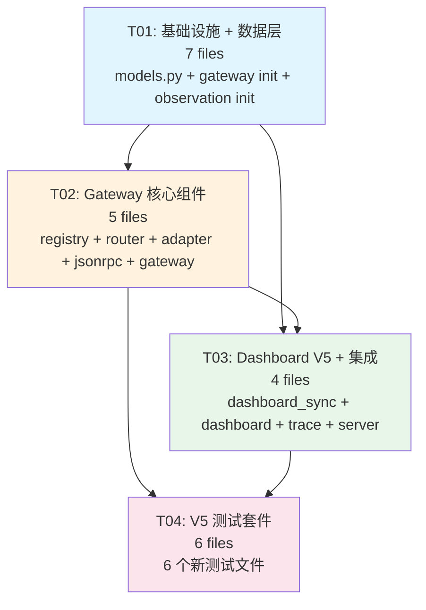

# StableAgent OS V5 — 统一 MCP Gateway 系统设计

> **作者**: Bob (Architect)
> **版本**: 0.2.0
> **日期**: 2025-05-28
> **依赖**: V4 代码库（553/553 测试通过）

---

## Part A: 系统设计

### 1. Implementation Approach

#### 1.1 核心技术挑战

| 挑战 | 分析 | 策略 |
|------|------|------|
| **工具端点分散** | V4 工具分布在 3 处：`/mcp/api/*`（7 个）、`/mcp/tools/list+call`（12 个 V3 工具）、`/mcp/tools/skillopt/*`（10 个 V4 工具），无统一命名空间 | 新建 `gateway/` 子包，14 个统一 namespaced 工具通过 JSON-RPC 2.0 单一入口 `POST /mcp` 暴露 |
| **Dashboard 事件广播** | V4 Dashboard 通过全局 WebSocket `/ws/events` 广播所有事件，客户端无法按 `run_id` 筛选 | 新建 `observation/` 子包，提供 `GET /mcp` SSE + `/ws/runs/{run_id}` WebSocket，按 `run_id` 分发 |
| **Trace 事件缺失** | V4 EventBus 有 `start_span/end_span` 但工具调用不自动发布 trace 事件（`mcp.call.received` → `tool.completed`） | ToolRouter 在每次工具调用时发布完整 trace 事件链，包含 `run_id/tool_call_id/trace_id/span_id/parent_span_id/avatar_state` |
| **审批流程分散** | V4 审批通过 REST API 单独调用，不与工具调用链路耦合 | ToolRouter 内嵌审批检查：调用前检查风险等级，高风险自动创建 `ApprovalRequest` 并阻塞等待 |
| **像素机器人状态** | V4 无非确定性状态展示 | 新增 `AVATAR_STATE_MAP`（13 种状态），trace 事件携带 `avatar_state` 字段 |
| **与 V4 系统的融合** | 不能破坏 553 个已有测试 | 旧 REST 端点保留为 legacy fallback；所有新代码放在 `gateway/` 和 `observation/` 子包中；不删除/重命名现有接口 |

#### 1.2 框架与库选择

| 组件 | 选择 | 理由 |
|------|------|------|
| 协议层 | JSON-RPC 2.0 | MCP 标准协议，单一 `POST /mcp` 入口 |
| SSE 流 | `sse-starlette` | FastAPI 原生 SSE 支持，按 `run_id` 过滤事件 |
| WebSocket | FastAPI WebSocket | 与 V4 一致，新增 per-run 实例 |
| 数据模型 | `@dataclass` | 与 V4 一致，零额外依赖 |
| 事件系统 | 现有 `EventBus` | 扩展 `EventStream`（按 run_id 过滤的包装器） |
| 审批 | 现有 `ApprovalManager` + `SecurityPolicy` | ToolRouter 内嵌调用，不改变审批模型 |
| 测试 | pytest + pytest-asyncio | 与 V4 一致 |

#### 1.3 架构模式

```
┌─────────────────────────────────────────────────────────────┐
│                      web/server.py                          │
│  ┌──────────────────────┐  ┌───────────────────────────┐    │
│  │ POST /mcp (JSON-RPC) │  │ GET /mcp (SSE)            │    │
│  │ GET /ws/runs/{id}    │  │ /runs/{id} (Dashboard)    │    │
│  └──────────┬───────────┘  └─────────────┬─────────────┘    │
│             │                            │                   │
│  ┌──────────▼────────────────────────────▼─────────────┐    │
│  │               MCPGateway (gateway/mcp_gateway.py)    │    │
│  │  ┌──────────────┐ ┌──────────────┐ ┌─────────────┐  │    │
│  │  │JSONRPCHandler│ │  ToolRouter  │ │RespAdapter  │  │    │
│  │  │(jsonrpc)     │ │  (routing+   │ │(result→MCP) │  │    │
│  │  │              │ │   approval+  │ │             │  │    │
│  │  │              │ │   events)    │ │             │  │    │
│  │  └──────────────┘ └──────┬───────┘ └─────────────┘  │    │
│  │                          │                            │    │
│  │  ┌───────────────────────▼────────────────────────┐  │    │
│  │  │      UnifiedToolRegistry (14 tools)            │  │    │
│  │  │  stableagent.task.* / context.* / memory.*     │  │    │
│  │  │  rag.* / eval.* / badcase.* / skillopt.*      │  │    │
│  │  │  trace.* / approval.*                          │  │    │
│  │  └────────────────────────────────────────────────┘  │    │
│  └──────────────────────────────────────────────────────┘    │
│                                                              │
│  ┌──────────────────────────────────────────────────────┐    │
│  │          observation/ (per-run 事件基础设施)          │    │
│  │  ┌──────────────┐ ┌──────────────┐ ┌──────────────┐ │    │
│  │  │  RunStore    │ │ EventStream  │ │DashboardSync │ │    │
│  │  │(run+events)  │ │(per-run bus) │ │(per-run WS)  │ │    │
│  │  └──────────────┘ └──────────────┘ └──────────────┘ │    │
│  └──────────────────────────────────────────────────────┘    │
│                                                              │
│  ┌──────────────────────────────────────────────────────┐    │
│  │  V4 遗留 REST (保留为 fallback)                       │    │
│  │  /mcp/api/*  + /mcp/tools/* + /mcp/tools/skillopt/*  │    │
│  └──────────────────────────────────────────────────────┘    │
└─────────────────────────────────────────────────────────────┘
```

**核心设计决策**：
- `MCPGateway` 是 V5 的统一入口，组合 JSONRPCHandler + ToolRouter + ResponseAdapter
- `UnifiedToolRegistry` 注册全部 14 个 namespaced 工具，替代 V4 的 `MCPToolRegistry` + `SkillOptMCPTools`
- `ToolRouter` 负责路由→审批检查→事件发布→工具调用→结果适配 全流程
- `observation/` 提供按 `run_id` 的事件分发能力，Dashboard 从全局广播升级到 per-run 订阅
- 旧 REST 端点保留在 `/mcp/` 下，标记为 legacy，不删除

---

### 2. File List

#### 2.1 新增目录与文件（15 个文件）

```
stable_agent/
  gateway/                              # 新建包 — 统一 MCP Gateway
    __init__.py                         # 包初始化，导出 MCPGateway
    run_context.py                      # RunContext 数据类
    tool_schemas.py                     # 14 个工具的 JSON Schema 定义
    unified_tool_registry.py            # UnifiedToolRegistry — 工具注册/调用
    tool_router.py                      # ToolRouter — 路由+审批+事件发布
    response_adapter.py                 # ResponseAdapter — StableAgentToolResult→MCP content
    jsonrpc_handler.py                  # JSONRPCHandler — JSON-RPC 2.0 消息处理
    mcp_gateway.py                      # MCPGateway — 主入口，组合所有组件

  observation/                          # 新建包 — per-run 事件基础设施
    __init__.py                         # 包初始化，导出 RunStore, EventStream, DashboardSync
    run_store.py                        # RunStore — 按 run_id 存储 RunRecord + events
    event_stream.py                     # EventStream — 按 run_id 分发事件的 EventBus 扩展
    dashboard_sync.py                   # DashboardSync — WebSocket 按 run_id 管理连接
```

#### 2.2 修改文件（4 个）

```
stable_agent/
  models.py                             # 新增: StableAgentToolResult, RunContext, AVATAR_STATE_MAP
  trace_event_bus.py                    # 新增: EventBus.publish_trace_event(), EventBus.get_events_by_run()
  dashboard.py                          # 修改: 使用 observation/ 的 per-run WebSocket
web/
  server.py                             # 修改: 挂载 MCPGateway，新增 SSE + per-run WS 路由
```

#### 2.3 新增测试文件（6 个）

```
tests/
  test_mcp_gateway.py                   # MCPGateway 端到端测试
  test_unified_tool_registry.py         # UnifiedToolRegistry 注册/调用测试
  test_dashboard_sync.py                # DashboardSync per-run WebSocket 测试
  test_mcp_response_adapter.py          # ResponseAdapter 转换测试
  test_tool_trace_integration.py        # Trace 事件链路集成测试
  test_approval_mcp_flow.py             # 审批 MCP 流程测试
```

---

### 3. Data Structures and Interfaces

#### 3.1 V5 新增数据模型 (models.py)

```python
@dataclass
class RunContext:
    """MCP 工具调用上下文。
    
    每次工具调用携带完整的追踪信息，由 MCPGateway 在入口处生成。
    """
    run_id: str                              # 运行 ID (UUID)
    tool_call_id: str                        # 工具调用 ID (UUID)
    trace_id: str                            # Trace ID (UUID)
    span_id: str                             # Span ID (UUID)
    parent_span_id: Optional[str] = None     # 父 Span ID
    avatar_state: str = "listening"          # 像素机器人状态


@dataclass  
class StableAgentToolResult:
    """统一工具返回结果。
    
    所有 14 个 unified tool 的 handler 必须返回此类型。
    ResponseAdapter 负责将其转换为 MCP content 格式。
    """
    ok: bool = True
    run_id: str = ""
    tool_call_id: str = ""
    tool_name: str = ""
    data: Optional[Any] = None
    plain_text: str = ""
    warnings: list[str] = field(default_factory=list)
    next_actions: list[str] = field(default_factory=list)
    trace_url: str = ""
    is_error: bool = False
```

#### 3.2 AVATAR_STATE_MAP

```python
AVATAR_STATE_MAP: dict[str, str] = {
    "listening": "👂 监听中",
    "thinking": "🤔 思考中",
    "calculating": "🧮 计算中",
    "reading_notes": "📖 查阅笔记",
    "searching_books": "🔍 搜索知识库",
    "safety_check": "🛡️ 安全检查",
    "waiting_approval": "✋ 等待审批",
    "working": "⚙️ 工作中",
    "grading": "📊 评分中",
    "writing_rule": "✍️ 编写规则",
    "examining": "🔬 检查中",
    "archiving": "📦 归档中",
    "sweating": "😰 遇到困难",
    "celebrating": "🎉 完成庆祝",
}
```

#### 3.3 Class Diagram

See `docs/class-diagram.mermaid` for the full Mermaid class diagram.

Key relationships:
- **MCPGateway** `--*` JSONRPCHandler, ToolRouter, ResponseAdapter
- **MCPGateway** `-->` RunStore, EventStream (observation)
- **ToolRouter** `-->` UnifiedToolRegistry, SecurityPolicy, ApprovalManager, EventBus
- **UnifiedToolRegistry** `-->` 14 tool handlers
- **JSONRPCHandler** `-->` ToolRouter (for tools/call)
- **ResponseAdapter** `..>` StableAgentToolResult (converts to MCP content)
- **DashboardSync** `-->` EventStream, RunStore
- **EventStream** `-->` EventBus (wraps with run_id filtering)

---

### 4. Program Call Flow

See `docs/sequence-diagram.mermaid` for the full sequence diagrams.

#### 4.1 JSON-RPC tools/call 完整流程

```
Client POST /mcp {"method":"tools/call","params":{"name":"stableagent.task.process","arguments":{...}}}
  → JSONRPCHandler.parse_message()
    → 验证 JSON-RPC 2.0 格式
    → 路由到 tools/call
  → JSONRPCHandler.handle_tools_call()
    → 生成 RunContext (run_id, tool_call_id, trace_id, span_id)
    → EventBus.publish_trace_event("mcp.call.received", ctx)
  → ToolRouter.route(ctx, tool_name, arguments)
    → UnifiedToolRegistry.lookup(tool_name)
    → SecurityPolicy.classify_command() / should_require_approval()
    → if approval_required:
        → ApprovalManager.create_request()
        → EventBus.publish_trace_event("tool.risk_checked", ctx, "high")
        → EventBus.publish_trace_event("tool.waiting_approval", ctx)
        → raise ApprovalRequiredException (客户端轮询 approval.respond)
    → EventBus.publish_trace_event("tool.started", ctx, avatar_state="working")
    → handler(ctx, arguments) → StableAgentToolResult
    → EventBus.publish_trace_event("tool.completed", ctx, result)
  → ResponseAdapter.to_mcp_content(result)
    → [{"type":"text","text":"..."}, {"type":"resource","resource":{...}}]
  → JSON-RPC 2.0 Response {"jsonrpc":"2.0","id":1,"result":{...}}
```

#### 4.2 SSE 事件流

```
Client GET /mcp?run_id=xxx (Accept: text/event-stream)
  → MCPGateway.handle_sse(run_id)
    → EventStream.subscribe(run_id, callback)
    → 循环: yield SSE events (按 run_id 过滤)
    → 事件格式: event: <type>\ndata: <json>\n\n
```

---

### 5. Anything UNCLEAR

| 问题 | 假设 |
|------|------|
| **旧 REST 端点保留方式** | 保留在现有路径 `/mcp/api/*`、`/mcp/tools/*`、`/mcp/tools/skillopt/*`，添加 `Deprecation` warning header；不迁移到 `/mcp/legacy/` |
| **ApprovalRequiredException 阻塞机制** | V5 中审批为异步模式：ToolRouter 抛出异常 → JSONRPCHandler 返回 `{"error":{"code":-32000,"message":"approval_required"}}` → 客户端调用 `stableagent.approval.respond` → ToolRouter 重放原始调用 |
| **SSE 连接管理** | 每个 run_id 最多一个 SSE 连接；新连接替换旧连接；run 完成后 SSE 自动关闭并发送 `event: done` |
| **RunContext 生成时机** | 在 JSONRPCHandler.handle_tools_call() 中生成，不依赖外部传入（客户端可选传 run_id 用于关联） |
| **ToolRouter 审批的 SecurityPolicy 重用** | 直接调用现有 `SecurityPolicy.classify_command()` 和 `should_require_approval()`，14 个工具中只有 `stableagent.task.process` 可能触发审批（涉及命令执行） |
| **像素机器人 Avatar 前端渲染** | AVATAR_STATE_MAP 定义在 models.py 中，Dashboard 前端通过 trace 事件的 `avatar_state` 字段切换动画；不在此次后端范围内 |
| **TraceStorage 与 RunStore 的关系** | RunStore 是内存中按 run_id 的 RunRecord + events 索引；TraceStorage 是 JSONL 持久化层。RunStore 在启动时从 TraceStorage 回放，运行时内存优先 |

---

## Part B: Task Decomposition

### 6. Required Packages

```
- fastapi>=0.109.0          # Web 框架（已有）
- uvicorn[standard]>=0.27.0 # ASGI 服务器（已有）
- websockets>=12.0           # WebSocket 支持（已有）
- sse-starlette>=2.0.0       # V5 新增: SSE (Server-Sent Events) 支持
- pytest>=8.0                # 测试框架（已有）
- pytest-asyncio>=0.23.0     # 异步测试（已有）
```

### 7. Task List (ordered by dependency)

---

#### T01 — 项目基础设施 + 数据层 + 观察者基础设施

| 属性 | 值 |
|------|-----|
| **Task ID** | T01 |
| **Priority** | P0（阻塞所有后续任务） |
| **Dependencies** | 无 |

**Source Files（7 个）：**

```
stable_agent/models.py                        [MODIFY] 新增 StableAgentToolResult, RunContext, AVATAR_STATE_MAP
stable_agent/gateway/__init__.py              [NEW] 包初始化，导出 MCPGateway
stable_agent/gateway/run_context.py           [NEW] RunContext 数据类（run_id, tool_call_id, trace_id, span_id, parent_span_id, avatar_state）
stable_agent/gateway/tool_schemas.py          [NEW] 14 个统一工具的 input/output JSON Schema 定义
stable_agent/observation/__init__.py          [NEW] 包初始化，导出 RunStore, EventStream, DashboardSync
stable_agent/observation/run_store.py         [NEW] RunStore — 按 run_id 存储 RunRecord + events，支持从 TraceStorage 回放
stable_agent/observation/event_stream.py      [NEW] EventStream — 按 run_id 分发事件的 EventBus 包装器，支持 subscribe/unsubscribe
```

**关键集成点：**
- `RunContext` 使用 `uuid.uuid4()` 生成 ID
- `StableAgentToolResult` 的 `data` 字段类型为 `Optional[Any]`
- `tool_schemas.py` 中 14 个 schema 需与现有 V4 handler 的输入参数精确对齐
- `RunStore` 在 `__init__` 时接收可选的 `TraceStorage` 引用用于回放
- `EventStream` 包装现有 `EventBus`，在 `_on_event` 回调中按 `run_id` 路由

---

#### T02 — Gateway 核心组件

| 属性 | 值 |
|------|-----|
| **Task ID** | T02 |
| **Priority** | P0 |
| **Dependencies** | T01（需要 RunContext, tool_schemas, RunStore, EventStream） |

**Source Files（5 个）：**

```
stable_agent/gateway/unified_tool_registry.py   [NEW] UnifiedToolRegistry — 注册 14 个 namespaced 工具，提供 lookup/call
stable_agent/gateway/tool_router.py             [NEW] ToolRouter — 路由查找 + 审批检查（SecurityPolicy+ApprovalManager）+ 事件发布（trace 链）
stable_agent/gateway/response_adapter.py        [NEW] ResponseAdapter — StableAgentToolResult → MCP content [{type, text}] 转换
stable_agent/gateway/jsonrpc_handler.py         [NEW] JSONRPCHandler — JSON-RPC 2.0 消息解析（initialize/tools/list/tools/call），生成 RunContext
stable_agent/gateway/mcp_gateway.py             [NEW] MCPGateway — 主入口类，持有 ToolRouter+JSONRPCHandler+ResponseAdapter+RunStore+EventStream
```

**关键集成点：**
- `UnifiedToolRegistry` 的工具 handler 签名统一为 `(ctx: RunContext, arguments: dict) -> StableAgentToolResult`
- `ToolRouter` 持有 `SecurityPolicy` 和 `ApprovalManager` 引用（构造函数注入）
- `ToolRouter.route()` 的 trace 事件链：`mcp.call.received` → `tool.risk_checked` → `tool.started` → (`tool.progress`*) → `tool.completed/failed`
- `JSONRPCHandler` 严格遵循 JSON-RPC 2.0 规范：`{"jsonrpc":"2.0","id":...,"method":"...","params":{...}}`
- `MCPGateway` 构造函数接收所有 V4 核心模块引用（Orchestrator, EventBus, SecurityPolicy, ApprovalManager）
- 审批阻塞机制：`ToolRouter` 检测到需要审批时发布 `approval.required` 事件 + 创建 `ApprovalRequest`，返回 `{"error":{"code":-32000,"message":"approval_required","data":{"request_id":"..."}}}`

---

#### T03 — Dashboard V5 升级 + 服务集成

| 属性 | 值 |
|------|-----|
| **Task ID** | T03 |
| **Priority** | P0 |
| **Dependencies** | T01, T02（需要 observation 包 + MCPGateway） |

**Source Files（4 个）：**

```
stable_agent/observation/dashboard_sync.py     [NEW] DashboardSync — WebSocket 按 run_id 管理连接（/ws/runs/{run_id}），订阅 EventStream
stable_agent/dashboard.py                      [MODIFY] 新增 per-run WebSocket 端点 + /runs/{run_id} 页面路由 + 保留旧 /ws/events 兼容
stable_agent/trace_event_bus.py                [MODIFY] EventBus 新增 publish_trace_event() + get_events_by_run()；现有接口不变
web/server.py                                  [MODIFY] 挂载 MCPGateway（POST /mcp, GET /mcp SSE），注册 /ws/runs/{run_id}，保留旧路由
```

**关键集成点：**
- `DashboardSync` 构造函数接收 `EventStream` 引用
- `web/server.py` 中 MCPGateway 挂载方式：直接在 FastAPI app 上注册路由（不 mount 子应用，因为需要访问 `request` 上下文）
- `GET /mcp` SSE 端点：`MCPGateway.handle_sse(request, run_id)` 返回 `StreamingResponse`
- `publish_trace_event()` 封装 `EventBus.publish()` ，自动注入 `run_id/tool_call_id/trace_id/span_id/parent_span_id/avatar_state` 到 payload
- `get_events_by_run()` 从 RunStore 查询 events 列表
- Dashboard 新增 `/runs/{run_id}` 路由渲染 per-run 页面
- 旧 `/ws/events`（全局广播）保留但标记 deprecated，推荐使用 `/ws/runs/{run_id}`

---

#### T04 — V5 测试套件

| 属性 | 值 |
|------|-----|
| **Task ID** | T04 |
| **Priority** | P1 |
| **Dependencies** | T01, T02, T03（需要所有 V5 代码完成） |

**Source Files（6 个）：**

```
tests/test_mcp_gateway.py                  [NEW] MCPGateway 端到端测试：initialize/tools/list/tools/call 完整 JSON-RPC 流程
tests/test_unified_tool_registry.py        [NEW] UnifiedToolRegistry 注册验证（14 个工具名）+ 调用测试（mock handler）
tests/test_dashboard_sync.py               [NEW] DashboardSync per-run WebSocket 连接/订阅/断开测试
tests/test_mcp_response_adapter.py         [NEW] ResponseAdapter 转换测试：StableAgentToolResult → MCP content 各种场景
tests/test_tool_trace_integration.py       [NEW] Trace 事件链路集成测试：验证 6 种事件顺序 + run_id 正确传递
tests/test_approval_mcp_flow.py            [NEW] 审批 MCP 流程测试：approval_required → approval.respond → 重放
```

**关键集成点：**
- 所有测试使用 `pytest` + `pytest-asyncio`
- `test_mcp_gateway.py` 使用 `fastapi.testclient.TestClient` 模拟 HTTP 请求
- `test_dashboard_sync.py` 使用 `fastapi.testclient.TestClient` 的 WebSocket 测试能力
- 测试不依赖真实 LLM 调用（全部 mock）
- 确保 553 个已有测试仍然通过（`pytest tests/ -x` 全量回归）

---

### 8. Shared Knowledge

```
- 所有 JSON-RPC 2.0 响应格式: {"jsonrpc":"2.0","id":<id>,"result":{...}} 或 {"jsonrpc":"2.0","id":<id>,"error":{"code":<int>,"message":"..."}}
- JSON-RPC error codes: -32700(parse error), -32600(invalid request), -32601(method not found), -32602(invalid params), -32000(approval required)
- 所有工具 handler 签名: (ctx: RunContext, arguments: dict) -> StableAgentToolResult
- Trace 事件类型: mcp.call.received, tool.risk_checked, tool.started, tool.progress, tool.completed, tool.failed
- Trace 事件 payload 必须包含: run_id, tool_call_id, trace_id, span_id, parent_span_id, avatar_state
- StableAgentToolResult 的 plain_text 使用中文大白话
- 所有 UUID 使用 uuid.uuid4() 生成
- 时间戳统一使用 time.time() float 格式
- 旧 REST 端点保留，添加 "X-Deprecated: true" response header
- 新增代码禁止使用裸 except（必须 except Exception）
- 所有新增模块必须有完整的 __init__.py 导出
- SSE 事件格式: "event: <type>\ndata: <json>\n\n"
```

### 9. Task Dependency Graph


