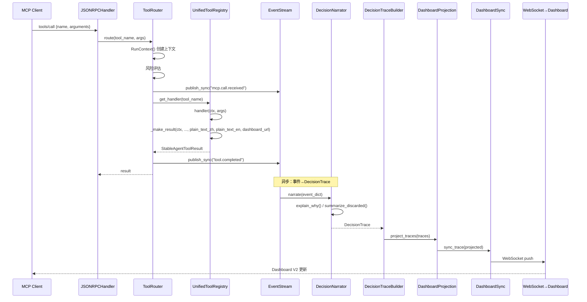
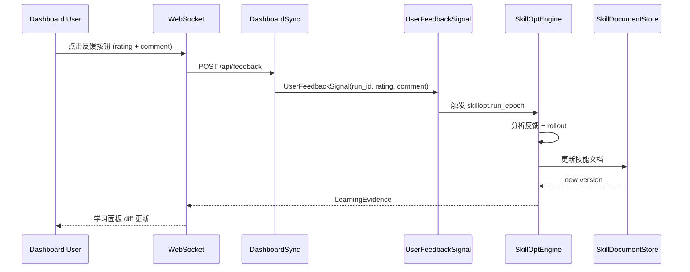
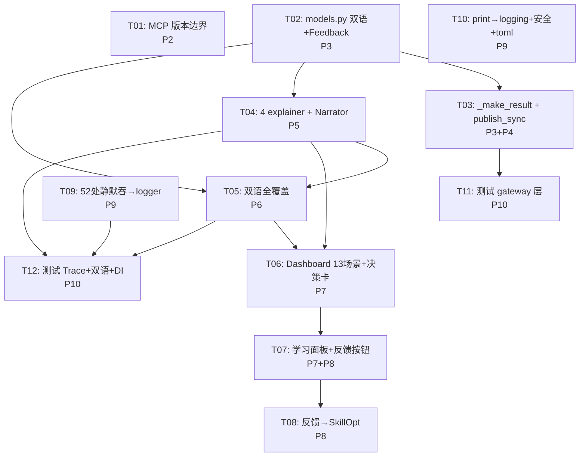

# StableAgent OS V5.6 — 系统架构设计文档

> 基于 V5.5 审计报告（`docs/refactor_audit_v56.md`）的工程治理升级设计。

---

## Part A: 系统设计

### A1. 实现方式

| 维度 | 选型 | 理由 |
|------|------|------|
| 语言 | Python ≥3.11 | 现有代码库一致性 |
| Web 框架 | FastAPI + Uvicorn | 已有 server.py |
| 前端 | Vanilla JS + ECharts | 已有 dashboard_v2 栈，无需新框架 |
| 数据模型 | `@dataclass` | 不可变性 + 类型安全 |
| 事件流 | asyncio.Queue (EventStream) | 已有基础设施 |
| 双语 | BilingualText + I18nManager | 已有基础，扩展即可 |
| 测试 | pytest | 已有 40 测试文件 |
| Lint | ruff | pyproject.toml dev 依赖 |
| 日志 | `logging` 模块 | 替代 print/静默吞 |

### A2. 文件清单（变更 + 新建）

```
stable_agent/
├── models.py                          # [修改] StableAgentToolResult + UserFeedbackSignal + TraceEvent
├── gateway/
│   ├── __init__.py                    # [修改] 导出新增
│   ├── tool_router.py                 # [修改] 删除 event loop 代码，使用 publish_sync
│   ├── unified_tool_registry.py       # [修改] _make_result 双语，handler 注入 event_stream
│   ├── tool_schemas.py               # [修改] AVATAR_STATE_MAP 扩展到 13 语义场景
│   ├── jsonrpc_handler.py            # [不变]
│   └── run_context.py                # [不变]
├── observation/
│   ├── __init__.py                    # [修改] 导出新增模块
│   ├── event_stream.py               # [修改] 新增 publish_sync()
│   ├── decision_trace.py             # [修改] 不变（已含 importance）
│   ├── decision_trace_builder.py     # [修改] 集成新 explainer
│   ├── run_insight.py                # [修改] 集成 LearningEvidence
│   ├── learning_evidence.py          # [修改] 增加 UserFeedbackSignal 关联
│   ├── dashboard_projection.py       # [修改] 13 语义场景 + diff 展示
│   ├── dashboard_sync.py             # [修改] 真实联动
│   ├── run_store.py                  # [不变]
│   └── user_feedback_signal.py       # [新建] UserFeedbackSignal 数据模型
├── explanation/
│   ├── __init__.py                    # [修改] 导出新模块
│   ├── bilingual_text.py             # [修改] 扩展模板
│   ├── decision_narrator.py          # [修改] explain_why/summarize_discarded
│   ├── explanation_templates.py      # [修改] 新增模板
│   ├── stage_explainer.py            # [新建] 阶段解释器
│   ├── evidence_summarizer.py        # [新建] 证据摘要器
│   ├── learning_explainer.py         # [新建] 学习解释器
│   └── user_friendly_formatter.py    # [新建] 用户友好格式化
├── git_diff_checkpoint.py            # [修改] timeout + resolve + .git 验证
├── workflow_state_machine.py         # [修改] print→logger
├── orchestrator.py                   # [修改] 10 处静默吞→logger
├── storage.py                        # [修改] 20 处静默吞→logger
├── dashboard.py                      # [修改] 5 处静默吞→logger
├── dashboard_sync.py                 # [修改] 2 处静默吞→logger
├── skillopt_tools.py                 # [修改] 2 处静默吞→logger
├── token_meter.py                    # [修改] 2 处静默吞→logger
├── skill_document_store.py           # [修改] 1 处静默吞→logger
├── trace_event_bus.py               # [修改] 5 处静默吞→logger
└── skill_optimizer/
    ├── patch_applier.py              # [修改] 真实落盘
    └── rejected_edit_buffer.py       # [修改] 真实落盘

web/
├── server.py                          # [修改] i18n 路由
├── templates/dashboard_v2.html        # [修改] 语义场景 + 反馈按钮
├── static/
│   ├── dashboard_v2.js               # [修改] 13 场景集成
│   ├── avatar_scene.js               # [修改] 13 语义场景映射
│   ├── decision_timeline.js          # [修改] "丢弃了什么"/"为什么"
│   ├── learning_panel.js             # [修改] diff 展示 + 未触发原因
│   ├── i18n.js                       # [修改] 双语扩展
│   └── styles_v2.css                 # [修改] 新增样式

pyproject.toml                         # [修改] 补充依赖

tests/
├── test_unified_tool_registry.py     # [新建] handler 签名 + DI
├── test_tool_schemas.py              # [新建] schema 验证
├── test_tool_router_events.py        # [新建] 事件链完整性
├── test_event_stream_sync_async.py   # [新建] sync/async 发布
├── test_no_silent_exceptions.py      # [新建] 全局扫描
├── test_dependency_injection.py      # [新建] DI 验证
├── test_user_feedback_signal.py      # [修改] 扩展
└── test_decision_narrator.py         # [修改] 扩展
```

### A3. 数据结构与接口

```mermaid
classDiagram
    %% ===== 模型层 =====
    class StableAgentToolResult {
        +bool ok
        +str run_id
        +str tool_call_id
        +str tool_name
        +dict data
        +str plain_text
        +str plain_text_zh
        +str plain_text_en
        +str dashboard_url
        +list~str~ warnings
        +list~str~ next_actions
        +str trace_url
        +bool is_error
    }

    class UserFeedbackSignal {
        +str feedback_id
        +str run_id
        +str span_id
        +str decision_trace_id
        +str signal_type
        +str comment_zh
        +str comment_en
        +int rating
        +float timestamp
        +bool processed
    }

    class TraceEvent {
        +str run_id
        +str span_id
        +str event_type
        +dict payload
        +str plain_text
        +str importance
        +dict decision_trace
        +float timestamp
    }

    class DecisionTrace {
        +str run_id
        +str span_id
        +DecisionStage stage
        +str title_zh
        +str title_en
        +str what_happened_zh
        +str what_happened_en
        +str why_zh
        +str why_en
        +list~DecisionEvidence~ evidence
        +list~DecisionEvidence~ discarded_evidence
        +str decision_zh
        +str decision_en
        +str risk_level
        +float confidence
        +EventImportance importance
        +str avatar_state
        +datetime timestamp
    }

    class DecisionEvidence {
        +str evidence_type
        +str title
        +str summary_zh
        +str summary_en
        +str source
        +float confidence
        +bool selected
        +str reason_zh
        +str reason_en
    }

    class LearningEvidence {
        +str evidence_id
        +str run_id
        +str skill_name
        +str before_snippet
        +str after_snippet
        +str diff_summary_zh
        +str diff_summary_en
        +str trigger_reason_zh
        +str trigger_reason_en
        +bool was_triggered
        +float confidence_gain
    }

    class RunInsight {
        +str run_id
        +str task_summary_zh
        +str task_summary_en
        +str final_result_zh
        +str final_result_en
        +float quality_score
        +float token_roi
        +list~LearningEvidence~ learning_evidences
        +bool learning_triggered
        +str improvement_summary_zh
        +str improvement_summary_en
    }

    class BilingualText {
        +str zh
        +str en
        +get(locale) str
    }

    %% ===== Gateway 层 =====
    class UnifiedToolRegistry {
        -dict _handlers
        -Any _orchestrator
        +get_handler(name) Callable
        +list_tools() list
        -_make_result(ctx, tool_name, ok, data, plain_text, plain_text_zh, plain_text_en, dashboard_url) StableAgentToolResult
        -_h_task_process(ctx, args) StableAgentToolResult
        -_h_context_build(ctx, args) StableAgentToolResult
        -_h_estimate_budget(ctx, args) StableAgentToolResult
        -_h_memory_retrieve(ctx, args) StableAgentToolResult
        -_h_memory_write(ctx, args) StableAgentToolResult
        -_h_rag_retrieve(ctx, args) StableAgentToolResult
        -_h_eval_evaluate(ctx, args) StableAgentToolResult
        -_h_badcase_record(ctx, args) StableAgentToolResult
        -_h_skillopt_status(ctx, args) StableAgentToolResult
        -_h_skillopt_current(ctx, args) StableAgentToolResult
        -_h_skillopt_epoch(ctx, args) StableAgentToolResult
        -_h_skillopt_export(ctx, args) StableAgentToolResult
        -_h_trace_get_run(ctx, args) StableAgentToolResult
        -_h_approval_respond(ctx, args) StableAgentToolResult
    }

    class ToolRouter {
        -UnifiedToolRegistry _registry
        -SecurityPolicy _security_policy
        -ApprovalManager _approval_manager
        -RunStore _run_store
        -EventStream _event_stream
        -EventBus _event_bus
        +route(tool_name, args) StableAgentToolResult
        -_assess_risk(tool_name, args) str
        -_make_event_dict(ctx, event_type, payload, plain_text) dict
        -_publish_event(event_dict) None
        -_append_to_store(run_id, event_dict) None
    }

    class JSONRPCHandler {
        -UnifiedToolRegistry _registry
        -ToolRouter _router
        -ResponseAdapter _adapter
        +handle(request) dict
        -_handle_initialize(req_id) dict
        -_handle_tools_list(req_id) dict
        -_handle_tools_call(req_id, params) dict
    }

    class RunContext {
        +str run_id
        +str tool_call_id
        +str trace_id
        +str span_id
        +str parent_span_id
        +float started_at
        +child_span() RunContext
    }

    %% ===== Observation 层 =====
    class EventStream {
        -dict _subscribers
        +subscribe(run_id) Queue
        +unsubscribe(run_id, queue) None
        +publish(run_id, event) None
        +publish_sync(run_id, event) None
        +publish_global(event) None
    }

    class RunStore {
        +append_event(run_id, event) None
        +get_events(run_id) list
        +get_run(run_id) dict
    }

    class DecisionTraceBuilder {
        +build_from_event(event) DecisionTrace
        +build_run_trace(run_id) list~DecisionTrace~
    }

    class RunInsightGenerator {
        +generate(run_id, traces, learning_evidences) RunInsight
    }

    class DashboardProjection {
        +project_traces(traces) list~dict~
        +project_insight(insight) dict
        +get_scene_for_stage(stage) str
    }

    class DashboardSync {
        +sync_trace(trace) None
        +sync_insight(insight) None
        +sync_feedback(feedback) None
    }

    %% ===== Explanation 层 =====
    class DecisionNarrator {
        -dict _stage_map
        -dict _template_map
        +narrate(event) DecisionTrace
        +explain_why(trace) str
        +summarize_discarded(trace) str
    }

    class StageExplainer {
        +explain_stage(stage, context) BilingualText
        +get_stage_i18n(stage) dict
    }

    class EvidenceSummarizer {
        +summarize(evidence_list, max_items) BilingualText
        +rank_by_confidence(evidence_list) list
    }

    class LearningExplainer {
        +explain_epoch(epoch_result) BilingualText
        +explain_patch(patch, validation) BilingualText
        +format_diff(before, after) dict
    }

    class UserFriendlyFormatter {
        +format_trace(trace, locale) str
        +format_insight(insight, locale) str
        +format_evidence(evidence, locale) str
    }

    class I18nManager {
        +get(key, locale) str
        +set_locale(locale) None
        +translate_stage(stage, locale) str
    }

    %% ===== 关系 =====
    ToolRouter --> UnifiedToolRegistry : uses
    ToolRouter --> RunContext : creates
    ToolRouter --> EventStream : publishes to
    ToolRouter --> RunStore : appends to
    JSONRPCHandler --> ToolRouter : routes through
    JSONRPCHandler --> UnifiedToolRegistry : lists tools
    UnifiedToolRegistry ..> StableAgentToolResult : returns
    DecisionNarrator --> DecisionTrace : produces
    DecisionNarrator --> StageExplainer : delegates
    DecisionNarrator --> EvidenceSummarizer : delegates
    DecisionTraceBuilder --> DecisionTrace : builds
    DecisionTraceBuilder --> DecisionNarrator : uses
    RunInsightGenerator --> RunInsight : produces
    RunInsightGenerator --> LearningEvidence : collects
    DashboardProjection --> DecisionTrace : projects
    DashboardProjection --> RunInsight : projects
    DashboardSync --> DashboardProjection : syncs
    LearningExplainer --> LearningEvidence : explains
    UserFriendlyFormatter --> DecisionTrace : formats
    UserFriendlyFormatter --> RunInsight : formats
    UserFeedbackSignal --> DecisionTrace : references
    UserFeedbackSignal --> LearningEvidence : triggers
    StableAgentToolResult --> BilingualText : embeds
    TraceEvent --> DecisionTrace : contains
```



### A4. 程序调用流程

#### 核心流程：tools/call → 事件链 → Dashboard



#### 用户反馈→SkillOpt 流程



### A5. 不明确点与假设

| 事项 | 假设 |
|------|------|
| Dashboard URL 格式 | `/dashboard/{run_id}` — 与现有 trace_url 一致 |
| 13 种语义场景 | 基于 AVATAR_STATE_MAP 扩展 + 阶段事件映射，非新增 Canvas 动画 |
| UserFeedback 处理方式 | 反馈写入 RunStore，由 DashboardSync 异步转发 SkillOptEngine |
| git_diff_checkpoint 安全 | subprocess 加 `timeout=30`，cwd 做 `Path.resolve()`，检查 `.git` 目录 |
| 静默吞异常处理 | 全部改为 `logger.exception("描述", exc_info=True)`，不新增异常类型 |
| publish_sync 实现 | 使用 `asyncio.run_coroutine_threadsafe()` 或在无 loop 时 `asyncio.run()` |

---

## Part B: 任务分解

### B1. 依赖包

```
- pydantic>=2.0.0        # 数据验证（pyproject.toml 补充）
- httpx>=0.27.0          # HTTP 客户端（pyproject.toml 补充）
- pytest>=8.0.0          # 测试框架（dev 依赖组）
- ruff>=0.5.0            # Lint（dev 依赖组）
```

### B2. 任务列表

| ID | Phase | 任务名 | 依赖 | 涉及文件 | 验证方式 |
|----|-------|--------|------|----------|----------|
| T01 | P2 | MCP 版本边界冻结 | [] | `gateway/__init__.py`, `mcp_server.py`, `mcp_tools.py`, `mcp/skillopt_tools.py` | V3/V4 文件顶部加 `# frozen: V5.6 — 仅 bug fix`，gateway `__init__.py` 加版本断言 |
| T02 | P3 | models.py 双语字段 + UserFeedbackSignal + TraceEvent | [] | `models.py` | `python -c "from stable_agent.models import StableAgentToolResult, UserFeedbackSignal; r=StableAgentToolResult(plain_text_zh='测试',plain_text_en='test'); assert r.plain_text_zh=='测试'"` |
| T03 | P3+P4 | _make_result 双语 + EventStream publish_sync | [T02] | `gateway/unified_tool_registry.py`, `observation/event_stream.py`, `gateway/tool_router.py` | `test_event_stream_sync_async.py` 通过；`tool_router.py` 中无 `get_event_loop` / `ensure_future` / `run_until_complete` |
| T04 | P5 | 新建 4 个 explainer + DecisionNarrator 扩展 | [T02] | `explanation/stage_explainer.py`(新), `evidence_summarizer.py`(新), `learning_explainer.py`(新), `user_friendly_formatter.py`(新), `decision_narrator.py`, `explanation/__init__.py` | `test_decision_narrator.py` 覆盖 explain_why / summarize_discarded |
| T05 | P6 | 双语全覆盖（models + 前端 i18n） | [T02,T04] | `models.py`, `explanation/bilingual_text.py`, `explanation/explanation_templates.py`, `web/static/i18n.js`, `web/templates/dashboard_v2.html` | `test_bilingual_text.py` 通过；Dashboard 切换 zh/en 显示正常 |
| T06 | P7 | Dashboard V2 — 13 语义场景 + 决策卡片升级 | [T04,T05] | `gateway/tool_schemas.py`, `observation/dashboard_projection.py`, `web/static/avatar_scene.js`, `web/static/decision_timeline.js`, `web/static/styles_v2.css` | Dashboard 打开后工具调用触发对应语义场景动画；决策卡片显示"丢弃了什么"/"为什么" |
| T07 | P7+P8 | Dashboard — 学习面板 diff + 反馈按钮 + RunInsight 卡片 | [T06] | `observation/learning_evidence.py`, `observation/run_insight.py`, `observation/user_feedback_signal.py`(新), `web/static/learning_panel.js`, `web/static/dashboard_v2.js`, `web/templates/dashboard_v2.html` | 反馈按钮点击生成 UserFeedbackSignal；学习面板显示 before/after diff |
| T08 | P8 | 反馈→SkillOpt 管道 | [T07] | `observation/dashboard_sync.py`, `observation/__init__.py`, `skill_optimizer/patch_applier.py`, `skill_optimizer/rejected_edit_buffer.py` | `test_user_feedback_signal.py` 通过；反馈触发 skillopt.run_epoch |
| T09 | P9 | 52 处静默吞→logger（storage + orchestrator + trace） | [] | `storage.py`, `orchestrator.py`, `trace_event_bus.py`, `dashboard.py`, `dashboard_sync.py`, `skillopt_tools.py`, `token_meter.py`, `skill_document_store.py` | `test_no_silent_exceptions.py` 扫描 0 处 `except Exception: pass` |
| T10 | P9 | print→logging + git_diff_checkpoint 安全 + pyproject.toml | [] | `workflow_state_machine.py`, `git_diff_checkpoint.py`, `pyproject.toml` | `grep 'print(' workflow_state_machine.py` 无结果；`git_diff_checkpoint.py` 中所有 subprocess 带 `timeout` + `Path.resolve` + `.git` 验证 |
| T11 | P10 | 测试：gateway 层（tools/list, tools/call, 事件链, sync/async） | [T03] | `tests/test_unified_tool_registry.py`(新), `test_tool_schemas.py`(新), `test_tool_router_events.py`(新), `test_event_stream_sync_async.py`(新) | `pytest tests/test_unified_tool_registry.py tests/test_tool_schemas.py tests/test_tool_router_events.py tests/test_event_stream_sync_async.py -v` 全部通过 |
| T12 | P10 | 测试：DecisionTrace + 双语 + DI + 无静默异常 | [T04,T05,T09] | `tests/test_decision_narrator.py`, `test_bilingual_text.py`, `test_dependency_injection.py`(新), `test_no_silent_exceptions.py`(新), `test_user_feedback_signal.py` | `pytest tests/test_decision_narrator.py tests/test_bilingual_text.py tests/test_dependency_injection.py tests/test_no_silent_exceptions.py tests/test_user_feedback_signal.py -v` 全部通过 |

### B3. 共享知识

```
- 所有 handler 签名：(_h_<domain>_<action>)(ctx: RunContext, args: dict) -> StableAgentToolResult
- _make_result 必须提供 plain_text_zh / plain_text_en（默认回退到 plain_text）
- EventStream.publish_sync() 使用 asyncio.run() 包装，仅在没有运行中的 loop 时调用
- 日志统一使用 logging.getLogger(__name__)，级别：exception 用 ERROR，吞异常改 WARNING
- V3 (mcp_server.py + mcp_tools.py) 和 V4 (mcp/skillopt_tools.py) 冻结：仅修复崩溃级 bug
- UserFeedbackSignal 写入 RunStore 后，由 DashboardSync 异步转发到 SkillOptEngine
- 所有 subprocess.run 必须带 timeout=30、cwd=Path.resolve()、检查 .git 存在
- 双语约定：_zh 后缀为中文，_en 后缀为英文，默认 locale=zh
- Dashboard URL 格式：/dashboard/{run_id}
- importance 取值：debug / normal / important / critical
```

### B4. 任务依赖图



### B5. Phase → 关键文件变更速查

| Phase | 动作 | 关键文件 |
|-------|------|----------|
| P2 | 冻结 V3/V4，锁定 V5 gateway | `gateway/__init__.py`, `mcp_server.py`, `mcp_tools.py`, `mcp/skillopt_tools.py` |
| P3 | models 新字段，_make_result 双语升级 | `models.py`, `gateway/unified_tool_registry.py` |
| P4 | EventStream publish_sync，删除 tool_router 手动 loop | `observation/event_stream.py`, `gateway/tool_router.py` |
| P5 | 新建 4 explainer + DecisionNarrator 扩展 | `explanation/stage_explainer.py`(新), `evidence_summarizer.py`(新), `learning_explainer.py`(新), `user_friendly_formatter.py`(新), `decision_narrator.py` |
| P6 | 双语字段全覆盖 + 前端 i18n | `models.py`, `explanation/bilingual_text.py`, `web/static/i18n.js` |
| P7 | Dashboard 13 语义场景 + 决策卡片 + 学习面板 | `observation/dashboard_projection.py`, `gateway/tool_schemas.py`, `web/static/avatar_scene.js`, `web/static/decision_timeline.js`, `web/static/learning_panel.js` |
| P8 | UserFeedbackSignal + 反馈→SkillOpt | `observation/user_feedback_signal.py`(新), `observation/dashboard_sync.py`, `skill_optimizer/patch_applier.py` |
| P9 | 52 处静默吞→logger，print→logging，git_diff 安全，pyproject.toml | `storage.py`, `orchestrator.py`, `trace_event_bus.py`, `git_diff_checkpoint.py`, `workflow_state_machine.py`, `pyproject.toml` |
| P10 | 6 个新测试 + 扩展现有测试 | `tests/test_unified_tool_registry.py`(新), `test_tool_schemas.py`(新), `test_tool_router_events.py`(新), `test_event_stream_sync_async.py`(新), `test_dependency_injection.py`(新), `test_no_silent_exceptions.py`(新) |
